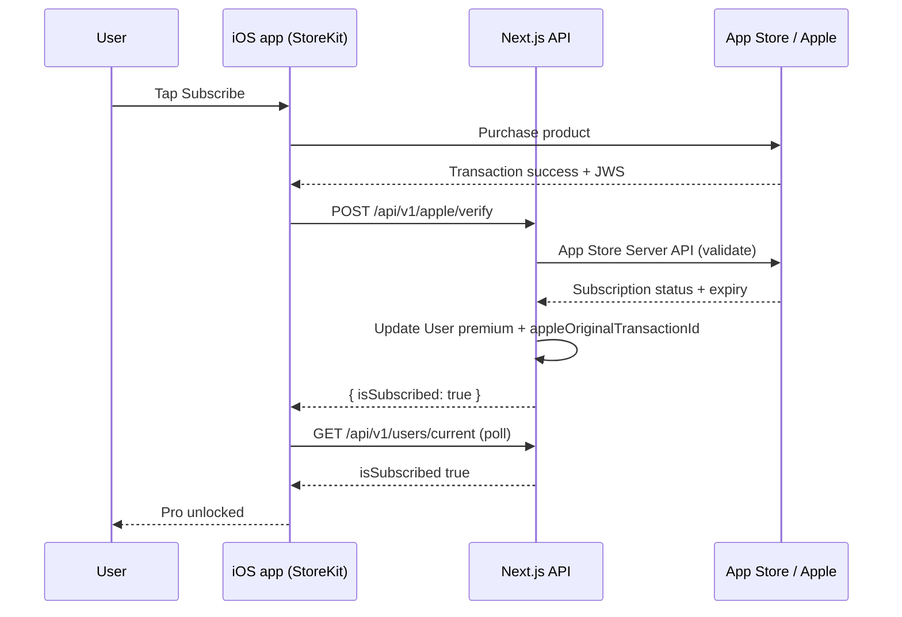
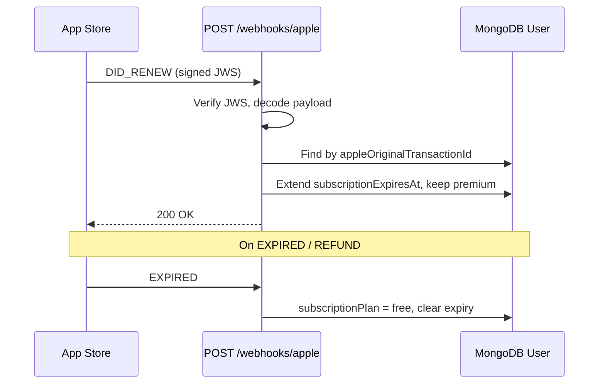

# Apple In-App Purchase (iOS) — Path A Implementation Guide

> **Path A (native):** StoreKit / In-App Purchase on iOS only. Stripe Checkout and Billing Portal on Android and web. One server-side entitlement; two payment rails.
>
> For Stripe keys, webhooks, and Android/web checkout, see [STRIPE_PAYMENTS_AND_KEYS.md](./STRIPE_PAYMENTS_AND_KEYS.md) and [stripe-implementation.md](./stripe-implementation.md).
>
> **Planned pricing update:** Quarterly/annual products, gated 14-day intro offer, and monthly price increase with subscriber preservation — see [PRICING_AND_TRIAL_MIGRATION.md](./PRICING_AND_TRIAL_MIGRATION.md).

---

## Table of Contents

1. [Goals & mental model](#1-goals--mental-model)
2. [Platform matrix](#2-platform-matrix)
3. [Mobile app responsibilities](#3-mobile-app-responsibilities)
4. [Backend (this Next.js repo)](#4-backend-this-nextjs-repo)
5. [App Store Connect setup](#5-app-store-connect-setup)
6. [Flow diagrams](#6-flow-diagrams)
7. [App Review & compliance](#7-app-review--compliance)
8. [Implementation checklist](#8-implementation-checklist)
9. [Local testing](#9-local-testing)
10. [Explicit non-goals](#10-explicit-non-goals)

---

## 1. Goals & mental model

### One entitlement on the server

Premium access is **not** split by platform. The same MongoDB fields drive gating everywhere:

| Field | Role |
|-------|------|
| `subscriptionPlan` | `"free"` \| `"premium"` |
| `subscriptionExpiresAt` | Period end (renewals extend this) |
| `subscriptionActivatedAt` | First activation timestamp |
| `isSubscribed` | Computed on `GET /api/v1/users/current` via `isUserSubscribed()` — clients should use this |

```typescript
// src/lib/api/user-subscription.ts — single source of truth
export function isUserSubscribed(user): boolean {
  if (!user || user.subscriptionPlan !== "premium") return false;
  if (isAppleSubscriptionActive(user)) return true; // active | billing_grace | billing_retry, or apple-paid + future expiry
  if (user.stripeSubscriptionStatus === "active" || user.stripeSubscriptionStatus === "trialing") return true;
  return expiresAtInFuture(user.subscriptionExpiresAt);
}
```

Apple-paid users are covered via `appleSubscriptionStatus` and `subscriptionPaymentMethod === "apple"` (see `isAppleSubscriptionActive` in the same file). Stripe status alone is not required for iOS-paid premium.

### Two payment rails

```
                    ┌─────────────────────────────────────┐
                    │     GET /api/v1/users/current       │
                    │  subscriptionPlan, isSubscribed     │
                    └─────────────────┬───────────────────┘
                                      │
              ┌───────────────────────┴───────────────────────┐
              │                                               │
     iOS app (StoreKit)                          Android + Web (Stripe)
              │                                               │
   POST /api/v1/apple/verify                      POST /api/v1/stripe/checkout
   POST /api/v1/webhooks/apple                   POST /api/v1/webhooks/stripe
              │                                               │
              └───────────────────────┬───────────────────────┘
                                      ▼
                            MongoDB User document
```

- **iOS:** User buys Pro via **StoreKit** (auto-renewable subscription). The app never opens Stripe Checkout or external pay links for digital Pro.
- **Android + Web:** User buys Pro via **Stripe** (existing routes). No StoreKit on those platforms.

### Cross-platform account

The same Better Auth user can sign in on iPhone, Android, and web. After any rail activates premium on the server, **all clients** see `isSubscribed: true` on the next `GET /api/v1/users/current` — no client-side merging of Stripe vs Apple state.

### Stripe reference (already implemented)

Mirror the same “webhook updates MongoDB → clients poll current user” pattern used for Stripe:

- Webhook handler: [`src/app/api/v1/webhooks/stripe/route.ts`](src/app/api/v1/webhooks/stripe/route.ts)
- Sets `subscriptionPlan = "premium"`, `subscriptionExpiresAt`, `subscriptionPaymentMethod = "stripe"`, Stripe IDs

Apple handlers should write the **same core fields** with `subscriptionPaymentMethod = "apple"` and Apple-specific identifiers for idempotency and support.

---

## 2. Platform matrix

| Platform | Payment rail | Must NOT use |
|----------|--------------|--------------|
| **iOS app** | StoreKit IAP (auto-renewable subscription) | Stripe Checkout URL, Billing Portal URL, or any external payment link for digital Pro |
| **Android app** | Stripe (`POST /api/v1/stripe/checkout`, portal) | StoreKit, `expo-in-app-purchases` for Pro |
| **Web app** | Stripe (hosted Checkout + portal) | StoreKit |

**Rule:** digital subscription for the same Pro SKU → platform-native billing per Apple Guideline 3.1.1 on iOS.

---

## 3. Mobile app responsibilities

The React Native / Expo app lives in a separate repo; this section defines contracts against **this** API. Step-by-step Expo checklists (iOS StoreKit + Android Stripe): [MOBILE_EXPO_BILLING.md](./MOBILE_EXPO_BILLING.md).

### Platform branching

Every upgrade / manage / restore entry point must branch on `Platform.OS`:

```typescript
import { Platform } from "react-native";

if (Platform.OS === "ios") {
  // StoreKit: purchase, restore, subscription management sheet
} else {
  // Stripe: POST checkout / portal, open returned url in Custom Tabs / WebBrowser
}
```

### Conceptual `billing.ts` module

Centralize payment logic so screens stay dumb:

| Function | iOS behavior | Android behavior |
|----------|--------------|------------------|
| `startUpgrade()` | Initiate StoreKit purchase for `APPLE_PRO_MONTHLY_PRODUCT_ID` (from app config / remote config matching App Store Connect) | `POST /api/v1/stripe/checkout` → open `{ url }` |
| `manageSubscription()` | Open iOS **Manage Subscriptions** UI (StoreKit 2 / `showManageSubscriptions` or Settings deep link) | `POST /api/v1/stripe/portal` → open `{ url }` |
| `restorePurchases()` | Restore transactions via StoreKit, then `POST /api/v1/apple/verify` per restored entitlement | N/A (Stripe state is server-side; refresh `GET /api/v1/users/current`) |

**Never** call `POST /api/v1/stripe/checkout` or open a `checkout.stripe.com` URL when `Platform.OS === "ios"`.

### `premium.tsx` (subscriptions screen) patterns

| UI element | iOS | Android |
|------------|-----|---------|
| Primary CTA (not subscribed) | **Subscribe** → `startUpgrade()` (StoreKit) | **Upgrade to Pro** → Stripe checkout URL |
| Secondary action | **Restore purchases** → `restorePurchases()` | Optional: refresh profile only |
| Subscribed: manage | **Manage subscription** → iOS subscription management | **Manage subscription** → Stripe portal URL |
| After purchase | Call `POST /api/v1/apple/verify` with transaction JWS / IDs, then poll `GET /api/v1/users/current` (same 2s × 5 pattern as Stripe success) | Poll after returning from Stripe redirect / deep link |

### Client gating (unchanged)

- Use `user.isSubscribed` from `GET /api/v1/users/current` — do not reimplement expiry logic on device.
- On `402` with `code: "SubscriptionRequired"` from premium API routes, show paywall → subscriptions screen.
- iOS paywall must route to StoreKit flow only.

### Libraries (Path A)

Typical stack: `expo-in-app-purchases`, `react-native-iap`, or StoreKit 2 wrappers — choice is mobile-repo specific. Server verification uses **App Store Server API** + **App Store Server Notifications V2**, not client-trusted receipts alone.

---

## 4. Backend (this Next.js repo)

### Environment variables

From [`.env.example`](.env.example) (Apple IAP section). **Separate from** `APPLE_CLIENT_ID` / Sign in with Apple OAuth keys.

| Variable | Purpose |
|----------|---------|
| `APPLE_APP_STORE_ISSUER_ID` | App Store Connect API — Issuer ID |
| `APPLE_APP_STORE_KEY_ID` | API key Key ID |
| `APPLE_APP_STORE_PRIVATE_KEY` | Contents of `AuthKey_XXXX.p8` (multiline PEM) |
| `APPLE_BUNDLE_ID` | iOS bundle id (must match app / EAS) |
| `APPLE_PRO_MONTHLY_PRODUCT_ID` | Auto-renewable subscription product id |
| `APPLE_APP_STORE_SHARED_SECRET` | Optional legacy shared secret (`verifyReceipt`); prefer Server API + StoreKit 2 for new work |
| `APPLE_APP_STORE_ENVIRONMENT` | `sandbox` \| `production` — which App Store Server API host to call |

Never expose these to the mobile bundle or `NEXT_PUBLIC_*`.

### User model fields (implemented)

[`src/models/user.ts`](src/models/user.ts) includes Apple fields alongside Stripe:

| Field | Example value | Notes |
|-------|---------------|-------|
| `subscriptionPlan` | `"premium"` | Same as Stripe |
| `subscriptionExpiresAt` | `Date` | From App Store renewal / verify response |
| `subscriptionActivatedAt` | `Date` | First successful Apple activation |
| `subscriptionPaymentMethod` | `"apple"` | Distinguish from `"stripe"` / `"manual"` |
| `subscriptionProvider` | `"apple"` | Optional alias for analytics |
| `appleOriginalTransactionId` | string | Stable key across renewals; index sparse |
| `appleLatestTransactionId` | string | Optional — latest renewal |
| `appleSubscriptionStatus` | string | Optional — e.g. active, expired, billing_retry (mirror Stripe’s `stripeSubscriptionStatus`) |

Keep existing Stripe fields on the same document; a user should only have **one** active paid rail at a time. Reconciliation: prefer the subscription with the **later** `subscriptionExpiresAt`; do not let a stale Stripe webhook downgrade an active Apple sub (and vice versa).

### `isUserSubscribed` (implemented)

`src/lib/api/user-subscription.ts` returns `true` for Apple-paid premium without requiring `stripeSubscriptionStatus` (see §1).

### Endpoints (implemented)

#### `POST /api/v1/apple/verify`

**Purpose:** Immediate unlock after the user completes a purchase or restore on device.

**Auth:** Required (session / Bearer — same as other `/api/v1` routes).

**Request body:**

```json
{
  "transactionId": "2000000123456789",
  "originalTransactionId": "2000000123456789",
  "productId": "com.eklan.ai.pro.monthly",
  "signedTransactionInfo": "<JWS from StoreKit 2 if available>"
}
```

**Backend steps:**

1. Authenticate user.
2. Validate `productId` matches `APPLE_PRO_MONTHLY_PRODUCT_ID`.
3. Call **App Store Server API** (JWT signed with Issuer ID, Key ID, private key) to fetch subscription status / transaction history.
4. Verify JWS payloads (Apple root certificates / `@apple/app-store-server-library` or equivalent).
5. Map App Store expiry → `subscriptionExpiresAt`, set `subscriptionPlan = "premium"`, `subscriptionPaymentMethod = "apple"`, store `appleOriginalTransactionId`.
6. `save()` user; return `{ success: true, isSubscribed: true }`.

**Mobile:** Call immediately after `purchaseUpdated` / restore success, then poll `GET /api/v1/users/current` until `isSubscribed` is true.

#### `POST /api/v1/webhooks/apple`

**Purpose:** **App Store Server Notifications V2** — renewals, cancellations, refunds, grace period, billing retry.

**Auth:** Not user session. Verify **signed payload (JWS)** in the notification body per [Apple’s documentation](https://developer.apple.com/documentation/appstoreservernotifications). There is **no** `whsec_` env var like Stripe.

**Registration:** URLs configured in App Store Connect (not env vars):

| Environment | Example URL |
|-------------|-------------|
| Production | `{BETTER_AUTH_URL}/api/v1/webhooks/apple` |
| Sandbox | `https://staging.eklan.ai/api/v1/webhooks/apple` or ngrok tunnel for local dev |

**Handler outline (mirror Stripe webhook structure):**

Implemented in [`src/app/api/v1/webhooks/apple/route.ts`](src/app/api/v1/webhooks/apple/route.ts).

```typescript
// Same file layout as stripe/route.ts
export const dynamic = "force-dynamic";
export const runtime = "nodejs";

// 1. Read raw body
// 2. Decode / verify notification JWS (signedPayload)
// 3. Switch on notificationType + subtype
// 4. findUserByAppleOriginalTransactionId(originalTransactionId)
// 5. Update subscriptionPlan / subscriptionExpiresAt / appleSubscriptionStatus
// 6. Return 200 quickly; log failures for retry
```

**Notification types to handle (minimum):**

| Type | Action |
|------|--------|
| `SUBSCRIBED` / `DID_RENEW` | Extend `subscriptionExpiresAt`, keep `premium` |
| `EXPIRED` / `REVOKE` / `REFUND` | Downgrade to `free`, clear Apple ids as appropriate |
| `DID_FAIL_TO_RENEW` | Set grace / billing retry status; optionally keep access until expiry |
| `GRACE_PERIOD_EXPIRED` | Downgrade when grace ends |

Compare with Stripe events in [`src/app/api/v1/webhooks/stripe/route.ts`](src/app/api/v1/webhooks/stripe/route.ts): `checkout.session.completed`, `customer.subscription.updated`, `invoice.paid`, etc.

### Stripe vs Apple webhooks

| | Stripe | Apple (App Store Server Notifications V2) |
|---|--------|-------------------------------------------|
| Secret | `STRIPE_WEBHOOK_SECRET` (`whsec_...`) | None in env — trust JWS + Apple certs |
| Header | `stripe-signature` | Signed payload inside JSON body |
| Registration | Stripe Dashboard | App Store Connect → App → App Store Server Notifications |
| Local dev | `stripe listen --forward-to ...` | ngrok (or staging URL) → `/api/v1/webhooks/apple` |
| User lookup | `stripeCustomerId` | `appleOriginalTransactionId` (set at first verify) |
| Immediate unlock | Often via `checkout.session.completed` | **`POST /api/v1/apple/verify`** (notifications can lag) |

### Admin & manual grants

`POST /api/v1/admin/users/subscription` remains valid for comps and support. Use `subscriptionPaymentMethod = "manual"`. Same reconciliation rule as Stripe: later `subscriptionExpiresAt` wins; audit by payment method.

---

## 5. App Store Connect setup

1. **App record** — Bundle ID matches `APPLE_BUNDLE_ID` and the iOS binary (EAS / Xcode).
2. **Subscription group** — Create auto-renewable subscription (e.g. “Eklan Pro Monthly”).
3. **Product ID** — Copy into `APPLE_PRO_MONTHLY_PRODUCT_ID` (e.g. `com.eklan.ai.pro.monthly`).
4. **Pricing** — Set territories; localize display name/description for review.
5. **Sandbox testers** — Users and Access → Sandbox → Testers (use on device signed out of production Apple ID for IAP).
6. **App Store Connect API key** — Integrations → App Store Connect API → generate key, download `.p8` once → map to `APPLE_APP_STORE_KEY_ID`, `APPLE_APP_STORE_ISSUER_ID`, `APPLE_APP_STORE_PRIVATE_KEY`.
7. **Server Notification URLs (V2)** — App → App Information → App Store Server Notifications:
   - Production URL → production API host
   - Sandbox URL → staging or ngrok
8. **Optional:** App-Specific Shared Secret → `APPLE_APP_STORE_SHARED_SECRET` only if legacy `verifyReceipt` is needed.

Paid Applications Agreement, tax, and banking must be active before subscriptions go live.

---

## 6. Flow diagrams

### iOS purchase + immediate verify



### Renewal / cancel via Server Notification V2



### ASCII summary (iOS only)

```
[Subscribe] → StoreKit purchase → POST /apple/verify → MongoDB premium
                                      ↓
                            GET /users/current → isSubscribed

[Renewal/Cancel] → Apple → POST /webhooks/apple → MongoDB sync
```

---

## 7. App Review & compliance

Apple **Guideline 3.1.1** requires In-App Purchase for digital content/subscriptions consumed in the app.

| Do on iOS | Do not on iOS |
|-----------|----------------|
| StoreKit for Pro subscription | Stripe Checkout, Payment Element, or Safari to `checkout.stripe.com` for the same Pro digital product |
| Restore purchases button | “Subscribe on our website” links that bypass IAP |
| Manage subscription via Apple UI | External payment CTAs for digital Pro |
| Explain that signing in on Android/web may use a different payment method (same account, server entitlement) | Implying users must pay twice |

Marketing sites may still describe pricing; the **iOS app** must complete digital upgrades through IAP.

Metadata: subscription display name, duration, and privacy policy URL must be accurate in App Store Connect.

---

## 8. Implementation checklist

### App Store Connect & secrets

1. [ ] Create auto-renewable subscription + product id
2. [ ] Configure sandbox testers
3. [ ] Create App Store Connect API key (`.p8`)
4. [ ] Set env vars on staging/production (never commit `.env`)
5. [ ] Register Production + Sandbox notification URLs (V2)

### Backend (this repo)

6. [x] Add Apple fields to User model + indexes on `appleOriginalTransactionId`
7. [x] Extend `isUserSubscribed()` for Apple-paid users
8. [x] Implement `POST /api/v1/apple/verify` with Server API + JWS validation
9. [x] Implement `POST /api/v1/webhooks/apple` (raw body, notification types above)
10. [x] Reconciliation rules when both Stripe and Apple fields exist
11. [x] Logging / admin tool to look up user by `appleOriginalTransactionId` (`GET`/`POST` `/api/v1/admin/users/apple-sync`)

### iOS mobile app

12. [ ] `Platform.OS === "ios"` branching in `billing.ts` / premium screen
13. [ ] StoreKit purchase + restore → verify endpoint
14. [ ] Poll `GET /api/v1/users/current` after purchase
15. [ ] Remove / guard any Stripe checkout URL on iOS
16. [ ] Manage subscription → Apple UI only on iOS

### Android + web (unchanged rail)

17. [ ] Stripe checkout + portal only (see [stripe-implementation.md](./stripe-implementation.md))
18. [ ] Webhook `POST /api/v1/webhooks/stripe` registered

### QA & release

19. [ ] Sandbox purchase end-to-end on physical device
20. [ ] Sandbox renewal / cancel via Server Notifications (or simulated in ASC)
21. [ ] Cross-device: iOS purchase → Android login shows Pro
22. [ ] App Review build uses IAP-only paywall on iOS

---

## 9. Local testing

### Sandbox IAP on device

1. Create a **Sandbox Apple ID** in App Store Connect.
2. On the test iPhone: Settings → App Store → Sandbox Account (sign in with sandbox user).
3. Build with development API pointing at staging or tunneled local backend.
4. Purchase the subscription product; confirm StoreKit returns a transaction.
5. Call `POST /api/v1/apple/verify` (via app) and confirm `GET /api/v1/users/current` returns `isSubscribed: true`.

Use `APPLE_APP_STORE_ENVIRONMENT=sandbox` so Server API calls hit the sandbox host.

### Apple webhooks locally

Apple cannot reach `localhost`. Options:

1. **ngrok** (or similar): `ngrok http 3000` → register `https://<id>.ngrok.io/api/v1/webhooks/apple` as the **Sandbox** notification URL in App Store Connect.
2. **Staging deploy:** point Sandbox URL at `https://staging.eklan.ai/api/v1/webhooks/apple` and test against staging DB.

Unlike Stripe CLI, there is no built-in forwarder — you need a public HTTPS URL.

### Stripe (Android / web) local testing

Unchanged: `stripe listen --forward-to localhost:3000/api/v1/webhooks/stripe`. See [STRIPE_PAYMENTS_AND_KEYS.md](./STRIPE_PAYMENTS_AND_KEYS.md) §6.

### Verify notification delivery

App Store Connect → your app → App Store Server Notifications → view recent deliveries and HTTP status. Fix 4xx/5xx on the webhook route; Apple retries on failure.

---

## 10. Explicit non-goals

This project chose **Path A (native StoreKit + custom server verification)**, not:

| Not chosen | Why documented here |
|------------|---------------------|
| **RevenueCat** (or other subscription SDK) | Would abstract StoreKit + Stripe; Path A keeps Apple logic in-house next to existing Stripe webhook code |
| **Single Stripe Checkout on iOS** | App Review rejection risk for digital subscriptions |
| **Client-only receipt trust** | Receipts/JWS must be validated on the server |
| **StoreKit on Android or web** | Platform matrix §2 |

If requirements change (e.g. unified analytics dashboard across stores), revisit RevenueCat in a separate ADR; this doc remains the reference for Path A.

---

## Related documentation

- [MOBILE_EXPO_BILLING.md](./MOBILE_EXPO_BILLING.md) — Expo team: platform matrix, API reference, iOS/Android checklists, sandbox testing
- [STRIPE_PAYMENTS_AND_KEYS.md](./STRIPE_PAYMENTS_AND_KEYS.md) — Stripe env vars, webhook forwarding, restricted keys
- [stripe-implementation.md](./stripe-implementation.md) — Implemented Stripe routes, `isUserSubscribed`, mobile Stripe checklist
- [PRICING_AND_TRIAL_MIGRATION.md](./PRICING_AND_TRIAL_MIGRATION.md) — Multi-plan pricing, gated trial, grandfathering (Stripe + Apple)
- [`.env.example`](.env.example) — Apple IAP and Stripe variable templates
