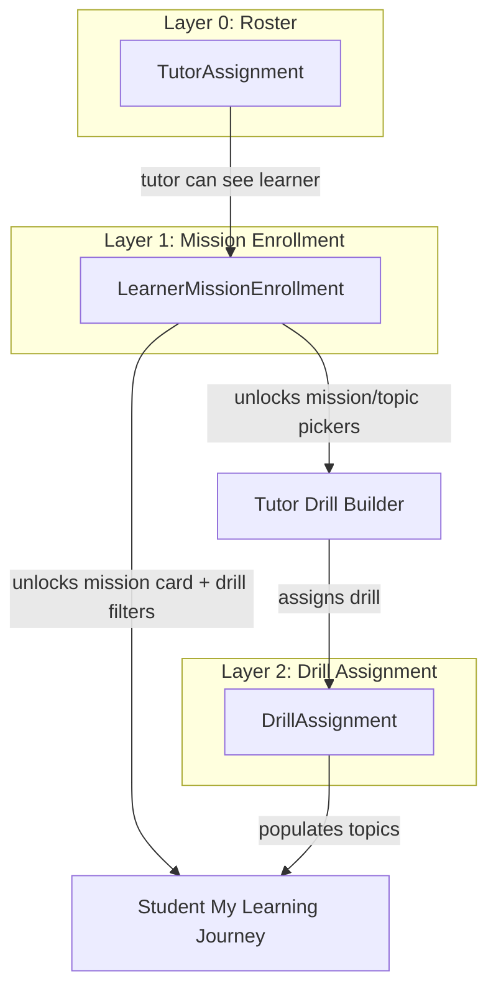
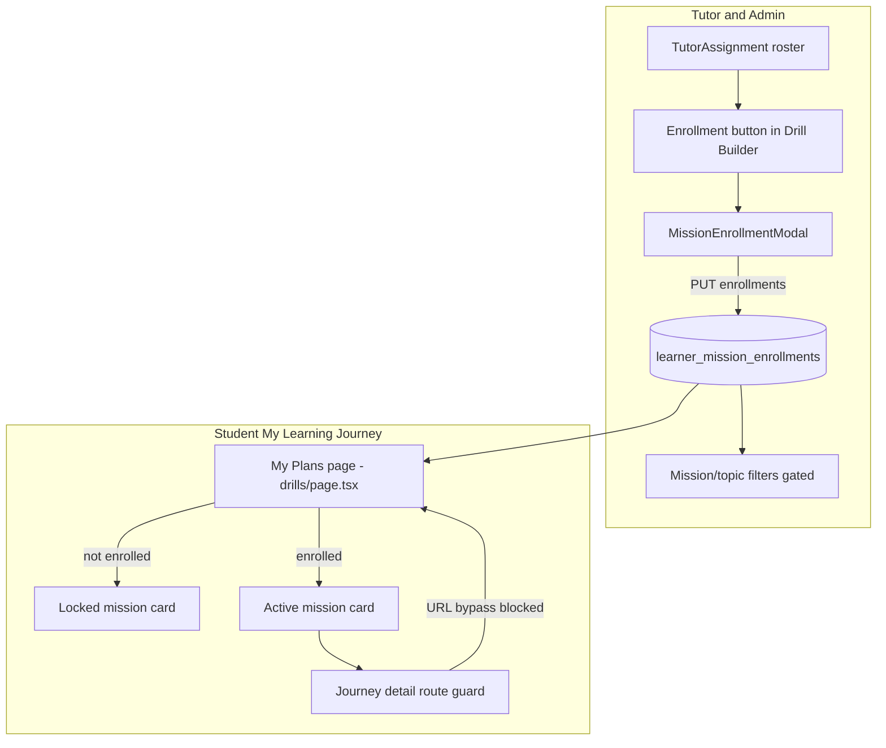

# Learning Journey Mission Enrollment — START HERE

> **Status:** Planned — not yet implemented  
> **Last updated:** July 10, 2026

---

## START HERE

### What this is

Mission-level enrollment gates access to Learning Journey missions (parts 1–5). Tutors and admins enroll learners per mission before assigning journey drills or unlocking mission cards on the student **My Learning Journey** page.

**Nothing is built yet** — no model, API routes, hooks, lock UI, or enrollment modal exist in the codebase.

### Product decisions (confirmed)

- **Unenrolled missions:** Locked cards with *"Not enrolled yet"* — visible but not tappable.
- **Existing students:** Auto-enroll only missions where they already have assigned drills (one-time migration).

### Three-layer stack



| Layer | Record | Unlocks for tutor | Unlocks for student |
|-------|--------|-------------------|---------------------|
| **Roster** | `TutorAssignment` | Learner appears in drill builder roster | N/A |
| **Enrollment** | `LearnerMissionEnrollment` | Mission/topic pickers in drill create/AI forms | Mission card becomes accessible (not locked) |
| **Assignment** | `DrillAssignment` | N/A (output of create flow) | Drill rows inside mission topics |

**Catalog:** 5 missions (parts 1–5) defined in `src/domain/learning-journey/learning-journey.catalog.ts`:

| Part | Title |
|------|-------|
| 1 | Communication with Patients |
| 2 | Communication with Colleagues |
| 3 | Communication with Doctors, Families and Friends |
| 4 | Interview Preparation |
| 5 | Bonus Scenarios |

### Doc map — which file to read

| I need… | Read |
|---------|------|
| **Step-by-step implementation** (this file) | `LEARNING_JOURNEY_MISSION_ENROLLMENT.md` (repo root) |
| **Full spec** (data model, APIs, UX flows, edge cases) | [`docs/learning-journey-mission-enrollment.md`](docs/learning-journey-mission-enrollment.md) |
| **Curriculum content** (24 topics across 5 missions) | [`docs/eklan-learners-journey.md`](docs/eklan-learners-journey.md) |
| **Student journey UI** (shipped; predates enrollment lock) | [`docs/eklan-mobile-learning-journey-spec.md`](docs/eklan-mobile-learning-journey-spec.md) |
| **Mobile mission enrollment** | [`docs/MOBILE_MISSION_ENROLLMENT.md`](docs/MOBILE_MISSION_ENROLLMENT.md) |
| **Enrollment data model pattern** | [`docs/classes-implementation.md`](docs/classes-implementation.md) + [`src/models/class-enrollment.ts`](src/models/class-enrollment.ts) |
| **Modal UX pattern** (assign tutor to student) | [`src/app/(admin)/admin/tutor/[tutorId]/students/page.tsx`](src/app/(admin)/admin/tutor/[tutorId]/students/page.tsx) |
| **Tutor drill builder flows** | [`docs/ai-drill-creation-full-implementation.md`](docs/ai-drill-creation-full-implementation.md) |

### Implementation order (5 phases)

1. **Phase 1 — Backend:** Model, repository, service, API routes, server enforcement, migration script
2. **Phase 2 — Tutor enrollment UI:** `MissionEnrollmentModal`, header button, student detail chip
3. **Phase 3 — Drill builder gating:** Filter mission/topic fields by enrolled parts
4. **Phase 4 — Student lock system:** Locked cards, route guard, `enrollments/me` integration
5. **Phase 5 — Polish:** Empty states, admin drill builder parity, optional tutor student page indicator

---

## How the lock system works



### Lock rules

1. **All 5 mission cards always render** on My Plans — enrollment does not hide missions.
2. **Not enrolled:** Card is a non-interactive `<div>` (not `<Link>`), greyed styling, lock icon, subtitle *"Not enrolled yet"*.
3. **Enrolled:** Current behavior — tappable link to `/account/drills/journey/[part]`.
4. **Enrolled but no drills:** Card is tappable; mission detail shows empty topic state (not locked).
5. **Direct URL access:** `journey/[part]/page.tsx` redirects to `/account/drills` with toast if not enrolled.
6. **Withdrawn enrollment:** Mission locks again; legacy drill assignments remain in DB but are hidden from journey UI until re-enrolled.

### Two features, one gate

| Feature | Who | What |
|---------|-----|------|
| **Student lock system** | Learner | Locked/unlocked mission cards on My Learning Journey |
| **Tutor enrollment system** | Tutor, Admin | Enroll/withdraw missions via Drill Builder modal; gates drill assignment |

Both features read/write the same `LearnerMissionEnrollment` records.

---

## IMPLEMENT: Student lock system

Work through these steps in order. **Prerequisite:** Phase 1 backend must expose `GET /api/v1/learning-journey/enrollments/me`.

### Step 1 — API client method

**File:** `src/lib/api.ts`

Add:

```typescript
learningJourneyAPI.getMyEnrollments()
```

Returns active enrolled parts for the authenticated learner.

### Step 2 — Student enrollment hook

**New file:** `src/hooks/useMissionEnrollments.ts`

Implement `useMyMissionEnrollments()`:

- Calls `GET /api/v1/learning-journey/enrollments/me`
- Returns `{ enrolledParts: LearningJourneyPartId[], isLoading, error }`
- Cache key scoped to current user

(Also add `useLearnerMissionEnrollments(learnerId)` and `useSetLearnerMissionEnrollments()` in the same file for tutor flows — see tutor section.)

### Step 3 — Locked mission card UI

**File:** `src/components/drills/LearningJourneyPartCard.tsx`

Add props:

- `isEnrolled: boolean`
- `isLocked: boolean` (derived: `!isEnrolled`)

Behavior:

| State | Render | Styling |
|-------|--------|---------|
| Enrolled | `<Link>` to journey detail | Current active card styles |
| Locked | `<div>` (not tappable) | Greyed, lock icon, subtitle *"Not enrolled yet"* |

Do not hide unenrolled cards — they remain visible.

### Step 4 — Wire My Plans page

**File:** `src/app/(student)/account/drills/page.tsx`

1. Call `useMyMissionEnrollments()` on page load.
2. Map over all 5 parts from `LEARNING_JOURNEY_PARTS`.
3. Pass `isEnrolled={enrolledParts.includes(part)}` to each `LearningJourneyPartCard`.
4. Handle loading state (skeleton or optimistic all-locked until fetch completes).

### Step 5 — Journey detail route guard

**File:** `src/app/(student)/account/drills/journey/[part]/page.tsx`

1. Fetch learner enrollments (server component or client guard).
2. If `part` is not in enrolled parts, redirect to `/account/drills`.
3. Show toast: *"You are not enrolled in this mission yet."*
4. Prevents URL bypass of locked cards.

### Step 6 — Optional: filter legacy drills from locked missions

**File:** `src/lib/learning-journey/group-journey-drills.ts`

When grouping drills by journey part, skip or exclude drills for parts where enrollment is withdrawn. Prevents stale assignments from appearing if a tutor withdraws enrollment.

### Step 7 — Student lock QA

See [QA checklist](#qa-checklist) below (student-specific items).

---

## IMPLEMENT: Tutor enrollment system

Work through these steps after Phase 1 backend is complete.

### Step 1 — Data model

**New file:** `src/models/learner-mission-enrollment.ts`

Mirror [`src/models/class-enrollment.ts`](src/models/class-enrollment.ts) pattern:

```typescript
interface ILearnerMissionEnrollment {
  learnerId: ObjectId;
  learningJourneyPart: 1 | 2 | 3 | 4 | 5;
  enrolledBy: ObjectId;
  enrolledAt: Date;
  status: 'active' | 'withdrawn';
  createdAt / updatedAt;
}
// Unique index: { learnerId, learningJourneyPart }
```

See [`docs/classes-implementation.md`](docs/classes-implementation.md) for enrollment lifecycle conventions.

### Step 2 — Domain layer

**New files:**

- `src/domain/learning-journey/mission-enrollment.repository.ts`
- `src/domain/learning-journey/mission-enrollment.service.ts`

Key helpers:

```typescript
getEnrolledPartsForLearner(learnerId): LearningJourneyPartId[]
isLearnerEnrolledInPart(learnerId, part): boolean
getEnrolledPartsForLearners(learnerIds[]): Map<learnerId, part[]>
setLearnerEnrollments(learnerId, parts, enrolledBy): void  // diff add/withdraw
```

### Step 3 — API routes

**New routes:**

| Method | Route | File |
|--------|-------|------|
| `GET` | `/api/v1/learning-journey/enrollments` | `src/app/api/v1/learning-journey/enrollments/route.ts` |
| `GET` | `/api/v1/learning-journey/enrollments/learner/[learnerId]` | `src/app/api/v1/learning-journey/enrollments/learner/[learnerId]/route.ts` |
| `PUT` | `/api/v1/learning-journey/enrollments/learner/[learnerId]` | same file |
| `GET` | `/api/v1/learning-journey/enrollments/me` | `src/app/api/v1/learning-journey/enrollments/me/route.ts` |

**Authorization** via [`src/domain/tutor-assignments/tutor-assignment.service.ts`](src/domain/tutor-assignments/tutor-assignment.service.ts):

- Tutors: only learners in their roster (`assertStaffCanReadLearner`)
- Admins: any learner
- Learners: read own enrollments only (`/me`)

### Step 4 — Enrollment modal (primary entry)

**New file:** `src/components/learning-journey/MissionEnrollmentModal.tsx`

Supporting components in same folder:

- `StudentMissionEnrollmentDetail` — lists 5 missions; enrolled = checkmark
- `MissionEnrollmentChecklist` — checkbox list of Missions 1–5; Save calls PUT

**UX pattern:** Follow modal flow from admin assign-tutor UI at [`src/app/(admin)/admin/tutor/[tutorId]/students/page.tsx`](src/app/(admin)/admin/tutor/[tutorId]/students/page.tsx) — search, student list, detail panel, confirm action.

**Modal flow:**

1. **Step 1 — Student list:** Reuse roster from `useTutorStudents` / `useAiDrillBuilderLearners`. Search, avatar, name, email. Badge: *"2/5 missions enrolled"*.
2. **Step 2 — Student detail:** Header with student info. *"Enrolled Missions"* section. **"Manage enrollments"** opens checklist.
3. **Checklist:** All 5 missions from `LEARNING_JOURNEY_PARTS`. Checked = enrolled. Save sends full desired set; server diffs add/withdraw.

**Wire into Drill Builder header:**

**File:** `src/components/ai-drill-builder/StudentListPage.tsx`

- Add `EnrollmentButton` in header → opens `MissionEnrollmentModal`

### Step 5 — Secondary entry on student detail

**File:** `src/components/ai-drill-builder/StudentDetailPage.tsx`

- Add *"Enrollments"* chip/button in header showing `2/5`
- Opens same modal pre-focused on current student

### Step 6 — Drill builder mission/topic gating

**File:** `src/components/admin/LearningJourneyPartTopicFields.tsx`

- New prop: `enrolledParts?: LearningJourneyPartId[]`
- Mission `<select>`: only show enrolled parts (or show all with disabled options + tooltip)
- Single student: fetch via `useLearnerMissionEnrollments(learnerId)`
- Multiple students: mission options = **intersection** of all selected students' enrollments
- Empty intersection: block save with *"No shared enrolled missions — enroll students first"*
- Disabled copy: *"Enroll this student in a mission first"* + link to open modal

**Wire gating into:**

- `src/components/drills/DrillFormBody.tsx`
- `src/components/drills/AIGenerationForm.tsx`
- `src/hooks/useAIDrillCreationWorkflow.ts`
- `src/components/drills/drill-form-utils.ts` (client validation)

### Step 7 — Server enforcement on drill routes

Reject drill create/assign if any `assigned_to` learner is not enrolled in the drill's `learning_journey_part`:

- `POST /api/v1/drills`
- Bulk-create routes
- Assign routes

Update `refineLearningJourneyFields` in `src/domain/learning-journey/learning-journey.validation.ts` with optional `enrolledParts` context.

### Step 8 — Migration script

**New file:** `scripts/migrate-mission-enrollments.mjs`

```text
For each DrillAssignment with populated drill.learning_journey_part:
  upsert LearnerMissionEnrollment(learnerId, part, enrolledBy=system, status=active)
```

Run once before deploy. Idempotent via unique index. **New students** start with zero enrollments.

---

## Backend reference (condensed)

### Model

| Field | Type | Notes |
|-------|------|-------|
| `learnerId` | ObjectId | ref User |
| `learningJourneyPart` | `1 \| 2 \| 3 \| 4 \| 5` | matches catalog |
| `enrolledBy` | ObjectId | tutor or admin |
| `enrolledAt` | Date | |
| `status` | `'active' \| 'withdrawn'` | |

Collection: `learner_mission_enrollments`  
Unique index: `{ learnerId, learningJourneyPart }`

### APIs

| Method | Route | Who |
|--------|-------|-----|
| `GET` | `/api/v1/learning-journey/enrollments` | Tutor, Admin |
| `GET` | `/api/v1/learning-journey/enrollments/learner/[learnerId]` | Tutor, Admin, Learner (own) |
| `PUT` | `/api/v1/learning-journey/enrollments/learner/[learnerId]` | Tutor, Admin |
| `GET` | `/api/v1/learning-journey/enrollments/me` | Learner |

### Hooks (`src/hooks/useMissionEnrollments.ts`)

| Hook | Used by |
|------|---------|
| `useMyMissionEnrollments()` | Student `drills/page.tsx` |
| `useLearnerMissionEnrollments(learnerId)` | Tutor drill builder |
| `useSetLearnerMissionEnrollments()` | Enrollment modal Save |

### API client (`src/lib/api.ts`)

```typescript
learningJourneyAPI.getMyEnrollments()
learningJourneyAPI.getLearnerEnrollments(learnerId)
learningJourneyAPI.setLearnerEnrollments(learnerId, parts: number[])
```

---

## Migration strategy

**Rule:** Auto-enroll existing students **only** for missions where they already have assigned drills with `learning_journey_part` set.

1. Write `scripts/migrate-mission-enrollments.mjs`
2. Run once in staging; verify counts per mission
3. Run in production before enabling lock UI
4. Idempotent — safe to re-run via unique index

**After migration:**

- Students with prior journey drills: enrolled in those missions only; other missions show locked
- Brand-new students: zero enrollments; tutor must enroll before assigning journey drills

---

## QA checklist

### Student lock system

- [ ] Subscribed student with zero enrollments sees all 5 missions; all locked with *"Not enrolled yet"*
- [ ] Enrolled in Mission 2 only: Mission 2 tappable; Missions 1, 3, 4, 5 locked
- [ ] Enrolled mission with no drills: card tappable; detail page shows empty topics (not locked)
- [ ] Direct URL `/account/drills/journey/3` when not enrolled → redirect + toast
- [ ] Direct URL when enrolled → mission detail loads
- [ ] Withdrawn enrollment locks card; legacy drills hidden from journey grouping

### Tutor enrollment system

- [ ] Enrollment button visible in Drill Builder header (`StudentListPage.tsx`)
- [ ] Modal: student search, list, detail, checklist for all 5 missions
- [ ] Save enrollments → PUT API → badge updates (`2/5`)
- [ ] Secondary entry on `StudentDetailPage.tsx` opens same modal
- [ ] Drill create: mission picker only shows enrolled parts for selected student
- [ ] Multi-student assign: only shared enrolled missions selectable
- [ ] Server rejects drill assign to unenrolled mission (not just UI block)
- [ ] Tutor cannot enroll learner outside their roster
- [ ] Admin can enroll any learner

### Migration

- [ ] Student with drills in parts 1 and 3 only → auto-enrolled in 1 and 3 after script
- [ ] Re-running migration script is idempotent (no duplicates)

---

## Related docs

- [`docs/learning-journey-mission-enrollment.md`](docs/learning-journey-mission-enrollment.md) — canonical deep spec
- [`docs/eklan-learners-journey.md`](docs/eklan-learners-journey.md) — curriculum (5 missions, 24 topics)
- [`docs/eklan-mobile-learning-journey-spec.md`](docs/eklan-mobile-learning-journey-spec.md) — student journey UI (predates lock)
- [`docs/MOBILE_MISSION_ENROLLMENT.md`](docs/MOBILE_MISSION_ENROLLMENT.md) — mobile handoff for locked missions (same backend)
- [`docs/MOBILE_MISSION_ENROLLMENT.md`](docs/MOBILE_MISSION_ENROLLMENT.md) — **mobile handoff** for locked missions (same backend)
- [`docs/classes-implementation.md`](docs/classes-implementation.md) — class enrollment pattern
- [`docs/ai-drill-creation-full-implementation.md`](docs/ai-drill-creation-full-implementation.md) — tutor drill builder
- [`src/domain/learning-journey/learning-journey.catalog.ts`](src/domain/learning-journey/learning-journey.catalog.ts) — mission/topic source of truth

---

## Out of scope

- Topic-level enrollment (sub-mission granularity)
- Sequential auto-unlock (Mission 2 after Mission 1 complete)
- Student self-enrollment
- Notifications on enrollment (*"You've been enrolled in Mission 2"*)
- Mobile-native app changes (web API supports both; mobile spec addendum deferred)
- Hiding unenrolled missions entirely (they stay visible, locked)

---

## Files to create / modify (summary)

### New files

| File | Purpose |
|------|---------|
| `src/models/learner-mission-enrollment.ts` | Mongoose model |
| `src/domain/learning-journey/mission-enrollment.repository.ts` | DB access |
| `src/domain/learning-journey/mission-enrollment.service.ts` | Business logic |
| `src/app/api/v1/learning-journey/enrollments/route.ts` | List enrollments |
| `src/app/api/v1/learning-journey/enrollments/learner/[learnerId]/route.ts` | Get/set per learner |
| `src/app/api/v1/learning-journey/enrollments/me/route.ts` | Student self-read |
| `src/hooks/useMissionEnrollments.ts` | React Query hooks |
| `src/components/learning-journey/MissionEnrollmentModal.tsx` | Tutor enrollment UI |
| `scripts/migrate-mission-enrollments.mjs` | One-time migration |

### Modified files

| File | Change |
|------|--------|
| `src/components/drills/LearningJourneyPartCard.tsx` | `isEnrolled` prop; locked state UI |
| `src/app/(student)/account/drills/page.tsx` | `useMyMissionEnrollments()` |
| `src/app/(student)/account/drills/journey/[part]/page.tsx` | Enrollment route guard |
| `src/components/ai-drill-builder/StudentListPage.tsx` | Enrollment button + modal |
| `src/components/ai-drill-builder/StudentDetailPage.tsx` | Enrollments chip |
| `src/components/admin/LearningJourneyPartTopicFields.tsx` | `enrolledParts` filter |
| `src/components/drills/DrillFormBody.tsx` | Wire enrollments |
| `src/components/drills/AIGenerationForm.tsx` | Wire enrollments |
| `src/hooks/useAIDrillCreationWorkflow.ts` | Wire enrollments |
| `src/components/drills/drill-form-utils.ts` | Client validation |
| `src/domain/learning-journey/learning-journey.validation.ts` | Server validation |
| `src/lib/api.ts` | API client methods |
| Drill API routes | Server-side enrollment validation |
