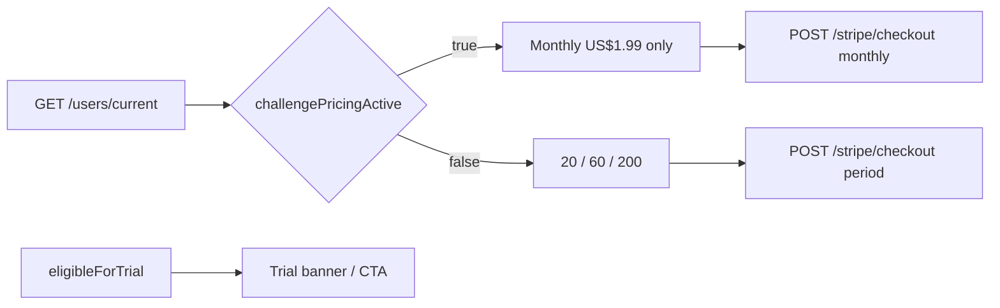

# Mobile Zero Pause Student Contract

> **ROLLED BACK — DO NOT IMPLEMENT**  
> Challenge / Maintainer **pricing** and `challengePricingActive` are no longer part of the payment system.  
> Use **[MOBILE_STRIPE_CHECKOUT_ROLLBACK.md](./MOBILE_STRIPE_CHECKOUT_ROLLBACK.md)** and the updated [STRIPE_ANDROID_MOBILE_CONTRACT.md](./STRIPE_ANDROID_MOBILE_CONTRACT.md).  
> This file is kept only as a historical record of the Phase 10 contract.

---

> **Audience:** Android / Expo team (Stripe Checkout — same API as web).  
> **Scope:** Student-facing paywall cohort UI for Zero Pause Challenge vs Maintainer/public pricing. **No admin screens. No app code in this repo.**  
> **Parent:** [STRIPE_PRICING_UPGRADE.md](./STRIPE_PRICING_UPGRADE.md) (Phase 10)  
> **Companion:** [STRIPE_ANDROID_MOBILE_CONTRACT.md](./STRIPE_ANDROID_MOBILE_CONTRACT.md) (base checkout / portal / 402)  
> **Status:** **Superseded** — pricing sync removed; admin Zero Pause labels may remain without price effects.

---

## Audience / scope

| Platform | Payment rail | This doc |
|----------|--------------|----------|
| **Android (Expo)** | Stripe Checkout + Portal | **In scope** — mirror web Challenge vs Maintainer paywall |
| **Web** | Stripe | Reference UI: student subscriptions page |
| **iOS (Expo)** | StoreKit / Apple IAP | **Challenge legacy monthly is Stripe-first / out of scope** — do not invent an Apple Challenge SKU unless product later approves one. See [docs/APPLE_IAP_IOS_IMPLEMENTATION.md](./docs/APPLE_IAP_IOS_IMPLEMENTATION.md) |

This document **owns** the Challenge pricing override. The Android contract still describes the default public three-plan paywall; when `challengePricingActive === true`, follow **this** file instead.

Admin Zero Pause assignment screens are **out of scope** for mobile.

---

## Related docs

| Doc | Why |
|-----|-----|
| [STRIPE_ANDROID_MOBILE_CONTRACT.md](./STRIPE_ANDROID_MOBILE_CONTRACT.md) | Base Android Stripe API (checkout, portal, 402, trial, polling) |
| [STRIPE_PRICING_UPGRADE.md](./STRIPE_PRICING_UPGRADE.md) | Parent plan — Phase 10 Zero Pause cohort pricing |
| [PRICING_AND_TRIAL_MIGRATION.md](./PRICING_AND_TRIAL_MIGRATION.md) | Cohort product rules and edge-case catalog |
| [docs/STRIPE_WEB_CHECKOUT_UI.md](./docs/STRIPE_WEB_CHECKOUT_UI.md) | Web paywall / CTA alignment |
| [docs/APPLE_IAP_IOS_IMPLEMENTATION.md](./docs/APPLE_IAP_IOS_IMPLEMENTATION.md) | iOS StoreKit — Challenge SKU not in scope |

---

## Locked product rules

Do not change without product sign-off.

| Cohort | Student paywall | Checkout |
|--------|-----------------|----------|
| **Maintainer / default** (`challengePricingActive === false`) | Monthly US$20, quarterly US$60, annual $200 | `POST /stripe/checkout` `{ billingPeriod }` → public Stripe prices |
| **Challenge active** (`challengePricingActive === true`) | **Only** monthly ~US$1.99 | Only `billingPeriod: "monthly"`; server uses legacy Price (`STRIPE_PREMIUM_MONTHLY_PRICE_ID_LEGACY`) |
| **Mastery** | **Not** a student paywall product — no Mastery price row, picker, or plan card | N/A |
| **Trial** | Still driven by `eligibleForTrial` | Server may still attach 14-day trial when eligible — Challenge does **not** cancel trial on web |



Web reference:

- [`src/app/(student)/account/settings/subscriptions/page.tsx`](./src/app/(student)/account/settings/subscriptions/page.tsx)
- [`src/app/api/v1/users/current/route.ts`](./src/app/api/v1/users/current/route.ts) (`challengePricingActive`)
- [`src/lib/api/zero-pause-pricing.ts`](./src/lib/api/zero-pause-pricing.ts)

---

## Source of truth — `GET /api/v1/users/current`

**Purpose:** Single source of truth for entitlement, trial UI, and Challenge vs Maintainer paywall.

### Fields mobile must use for this contract

| Field | Type | Use |
|-------|------|-----|
| `user.challengePricingActive` | `boolean` | **Paywall cohort switch.** `true` → Challenge UI (~US$1.99 monthly only). `false` → public three-plan UI. |
| `user.eligibleForTrial` | `boolean` | Show trial banner / **"Start free trial"** CTA only when `true`. Independent of Challenge. |
| `user.isSubscribed` | `boolean` | **Only** gate for Pro features (unchanged from Android contract). |

Response shape (relevant slice):

```json
{
  "user": {
    "isSubscribed": false,
    "eligibleForTrial": true,
    "challengePricingActive": false
  }
}
```

### Do not recompute Challenge on-device for pricing

- Server computes `challengePricingActive` via `isZeroPauseChallengePricingActive` (UTC inclusive window + `challenge` product).
- Mobile **must not** re-derive pricing from raw `zeroPauseProducts` / dates when `challengePricingActive` is present.
- Optional display of Challenge start/end dates is fine if those fields are returned — display only, not price logic.

---

## Paywall UI rules

Mirror web student subscriptions:

### When `challengePricingActive === true`

1. Show **one** plan option only: Monthly — **US$1.99** (copy may say ~US$1.99 / community Challenge price).
2. **Hide** quarterly and annual entirely.
3. Force selected period to `"monthly"` if Challenge becomes active while another period was selected.
4. Trial banner / CTA still follow `eligibleForTrial` only (Challenge does not suppress trial UI).

### When `challengePricingActive === false` (Maintainer / default)

1. Show **three** periods (same as [STRIPE_ANDROID_MOBILE_CONTRACT.md](./STRIPE_ANDROID_MOBILE_CONTRACT.md)):
   - Monthly — **US$20**
   - Quarterly — **US$60**
   - Annual — **$200**
2. Trial banner / CTA from `eligibleForTrial` only.

### Mastery

- Do **not** show Mastery as a subscribeable plan, price tier, or billing period.
- Mastery is not part of the student paywall product surface.

---

## Checkout — `POST /api/v1/stripe/checkout`

Same endpoint as the Android contract. Body is period only — **never** Stripe Price IDs.

```http
POST /api/v1/stripe/checkout
Authorization: Bearer <sessionToken>
Content-Type: application/json

{ "billingPeriod": "monthly" }
```

| Cohort | Allowed `billingPeriod` |
|--------|-------------------------|
| Challenge active | **`monthly` only** |
| Maintainer / default | `"monthly"` \| `"quarterly"` \| `"annual"` |

### Success — **200**

```json
{ "url": "https://checkout.stripe.com/c/pay/cs_..." }
```

Open `url` with `WebBrowser.openBrowserAsync` / Chrome Custom Tabs / `Linking.openURL`.

### Challenge rejection — **400**

If Challenge is active and the client sends `quarterly` or `annual`:

```json
{
  "code": "ValidationError",
  "message": "Challenge pricing is monthly only. Choose monthly billing during your Challenge window."
}
```

UI should not offer those periods while Challenge-active; treat **400** as a defensive failure (refresh `/users/current` and reset to monthly).

### What the server does (do not reimplement)

1. May apply Challenge expiry then resolve price via `resolveCheckoutPriceForUser`.
2. Challenge-active → legacy monthly Price; otherwise → public price map for `billingPeriod`.
3. If trial-eligible, may set `subscription_data.trial_period_days: 14` — **including** during Challenge.

Full checkout / portal / 402 / polling details: [STRIPE_ANDROID_MOBILE_CONTRACT.md](./STRIPE_ANDROID_MOBILE_CONTRACT.md).

---

## Refresh — keep cohort UI in sync

Refetch `GET /api/v1/users/current` so admin Challenge assign / expiry flips the paywall without reinstall:

| When | Action |
|------|--------|
| Login / session restore | Fetch `/users/current` |
| App foreground | Refetch (or invalidate cache) |
| After Checkout return / browser close | Poll until `isSubscribed` (Android contract: **2 s × 5**), and refresh `challengePricingActive` / `eligibleForTrial` |

Do not cache `challengePricingActive` for the lifetime of the install.

---

## What mobile must NOT do

| Do not | Why |
|--------|-----|
| Hardcode Stripe **Price IDs** (legacy or public) | Server maps period + cohort → env prices |
| Treat **Mastery** as a student paywall plan | Not a subscribeable product on mobile |
| End or suppress **trial** locally when Challenge is assigned | Web keeps trial; server owns `eligibleForTrial` + Checkout trial grant |
| Invent cohort logic from raw `zeroPauseProducts` / dates when `challengePricingActive` exists | Flag is the source of truth |
| Offer quarterly/annual Checkout while Challenge-active | Server returns **400** |
| Assume iOS StoreKit has a Challenge ~US$1.99 SKU | Out of scope unless product adds one |

---

## Acceptance checklist (mobile QA)

Track Pass/Fail against web behavior.

- [ ] **Challenge-active UI:** With `challengePricingActive === true`, paywall shows **only** monthly ~US$1.99; quarterly/annual hidden
- [ ] **Maintainer UI:** With `challengePricingActive === false`, paywall shows US$20 / US$60 / $200
- [ ] **Trial still shown when eligible:** `eligibleForTrial === true` shows trial banner / “Start free trial” even if Challenge-active
- [ ] **Checkout monthly-only under Challenge:** CTA sends `{ billingPeriod: "monthly" }`; no non-monthly Checkout calls while Challenge-active
- [ ] **Refresh:** After login / foreground / Checkout return, `/users/current` is refetched so cohort flag updates without reinstall
- [ ] **No Mastery plan UI** on the student paywall
- [ ] **No client Price IDs**; no on-device Challenge window recomputation for pricing

**External sign-off:** Mobile team confirms Challenge vs Maintainer paywall parity with web against this contract.
