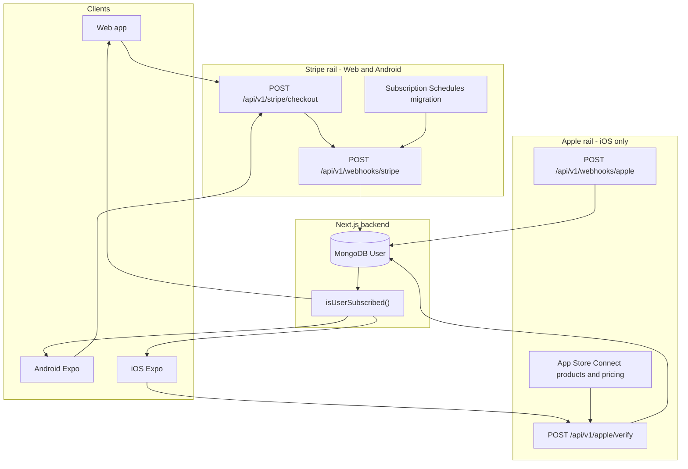
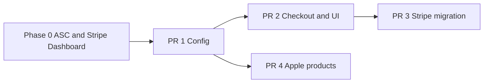

# Pricing Update + Gated Trial — Implementation Plan (Stripe + Apple)

> **Audience:** Backend, web, mobile (Expo), and ops teams.  
> **Scope:** Launch Monthly **US$20**, 3-month **US$60**, 1-year **$200**, with a **2-week (14-day) free trial** for post-launch new accounts only, while grandfathering existing monthly payers until their next renewal.  
> **Status:** Planning document — implementation PRs described below are **not yet shipped** in code.

**Related docs:**

| Document | Contents |
|----------|----------|
| [STRIPE_PAYMENTS_AND_KEYS.md](./STRIPE_PAYMENTS_AND_KEYS.md) | Stripe env vars, webhook forwarding |
| [stripe-implementation.md](./stripe-implementation.md) | Current Stripe checkout, portal, webhooks |
| [APPLE_IAP_IOS_IMPLEMENTATION.md](./APPLE_IAP_IOS_IMPLEMENTATION.md) | StoreKit, App Store Connect, Apple webhooks |
| [MOBILE_EXPO_BILLING.md](./MOBILE_EXPO_BILLING.md) | Platform matrix, mobile API contracts |
| [IOS_PAYMENT_AUDIT.md](./IOS_PAYMENT_AUDIT.md) | iOS payment audit and outstanding items |

---

## Table of Contents

1. [Locked business rules](#1-locked-business-rules)
2. [Architecture](#2-architecture)
3. [Phase 0 — Dashboard setup (no code)](#3-phase-0--dashboard-setup-no-code)
4. [PR 1 — Config + price/product mapping](#4-pr-1--config--priceproduct-mapping)
5. [PR 2 — Checkout + trial gating + UI (Stripe / web / Android)](#5-pr-2--checkout--trial-gating--ui-stripe--web--android)
6. [PR 3 — Migrate existing Stripe monthly payers at renewal](#6-pr-3--migrate-existing-stripe-monthly-payers-at-renewal)
7. [PR 4 — iOS App Store Connect + backend](#7-pr-4--ios-app-store-connect--backend)
8. [Cross-platform edge cases](#8-cross-platform-edge-cases)
9. [Environment variables](#9-environment-variables)
10. [Test checklist](#10-test-checklist)
11. [Deployment order](#11-deployment-order)
12. [Key file index](#12-key-file-index)

---

## 1. Locked business rules

These rules are **confirmed** and must not change without product sign-off.

| Rule | Behavior |
|------|----------|
| **Monthly price** | **US$20** / month (new subscribers) |
| **Quarterly price** | **US$60** / 3 months |
| **Annual price** | **$200** / year |
| **Free trial** | **2 weeks (14 days)**, only for **brand-new accounts** created **on or after** `SUBSCRIPTION_TRIAL_LAUNCH_AT` who have **never** had any subscription (Stripe or Apple) |
| **Old free accounts** (created before launch date) | **No trial** — pay from day one |
| **Former / current subscribers** | **No trial** — pay from day one |
| **Existing monthly Stripe payers** | Keep **current price** until `current_period_end`; new price at **next renewal** (no proration) |
| **Existing monthly Apple payers** | Use App Store Connect **"Preserve current price for existing subscribers"** when scheduling the monthly increase |

### Trial eligibility (authoritative server-side predicate)

```typescript
const LAUNCH_DATE = new Date(process.env.SUBSCRIPTION_TRIAL_LAUNCH_AT!);

function isEligibleForTrial(user: IUser): boolean {
  const isPostLaunchAccount = user.createdAt >= LAUNCH_DATE;
  const neverHadAnySubscription =
    !user.subscriptionActivatedAt &&
    !user.subscriptionProvider &&
    !user.stripeSubscriptionId &&
    !user.appleOriginalTransactionId;
  return isPostLaunchAccount && neverHadAnySubscription;
}
```

**Belt-and-suspenders:** before granting trial in checkout, also check Stripe subscription history for the customer (`subscriptions.list({ status: 'all', limit: 1 })`). Stripe has no visibility into Apple IAP — the DB check above is the source of truth for cross-platform eligibility.

---

## 2. Architecture

One account, one entitlement (`isSubscribed`), two payment rails by platform.



**Current state (before this project):**

- Stripe checkout is **monthly-only** — single `STRIPE_PREMIUM_MONTHLY_PRICE_ID` in [`src/app/api/v1/stripe/checkout/route.ts`](src/app/api/v1/stripe/checkout/route.ts).
- Apple verify accepts **monthly product only** — [`src/app/api/v1/apple/verify/route.ts`](src/app/api/v1/apple/verify/route.ts).
- No trial in checkout; no price migration / grandfathering logic.
- `subscriptionBillingPeriod` is set only via provider-sync, not webhooks.

**Target state:**

- Three purchasable durations on both rails.
- Trial gated server-side (Stripe) and server + client (Apple).
- Existing monthly payers grandfathered until renewal.

---

## 3. Phase 0 — Dashboard setup (no code)

Complete in **test mode first**, then mirror in **live**.

### 3.1 Stripe Dashboard

**Product structure:** One Product ("Eklan Pro" / "Premium"), multiple **Price** objects. Do **not** edit or delete the existing monthly Price — archive it after migration.

| Price | Amount | Recurring | Notes |
|-------|--------|-----------|-------|
| Legacy monthly | (current) | `interval: month`, `interval_count: 1` | Keep active for existing `sub_...` objects |
| New monthly | US$20 | `interval: month`, `interval_count: 1` | New checkouts |
| Quarterly | US$60 | `interval: month`, `interval_count: 3` | 3-month billing |
| Annual | $200 | `interval: year`, `interval_count: 1` | Yearly billing |

**Steps:**

1. Stripe Dashboard → **Products** → select existing Pro product (or create one).
2. **Add price** for each new tier (never edit live Price amounts — create new Prices).
3. Copy Price IDs (`price_...`) for env vars.
4. After all existing subscribers are migrated (PR 3), set legacy monthly Price to `active: false` (archive — do not delete).

**Trial:** Do **not** set a trial on the Price object alone. Gate trial via Checkout `subscription_data.trial_period_days` so eligibility is enforced server-side.

**References:**

- [How products and prices work](https://docs.stripe.com/products-prices/how-products-and-prices-work)
- [Manage products and prices](https://docs.stripe.com/products-prices/manage-prices)

### 3.2 App Store Connect

**Subscription group:** Add quarterly and annual products to the **same subscription group** as the existing monthly product, at the **same subscription level** (same tier of service, different durations).

| Product | Duration | Price tier | Product ID (example) |
|---------|----------|------------|----------------------|
| Pro Monthly | 1 month | US$20 (after increase) | `com.eklan.ai.pro.monthly` (existing) |
| Pro Quarterly | 3 months | US$60 | `com.eklan.ai.pro.quarterly` (new) |
| Pro Annual | 1 year | $200 | `com.eklan.ai.pro.annual` (new) |

**Steps:**

1. App → **Subscriptions** → subscription group → **Create subscription** for quarterly and annual.
2. Assign **same level** as monthly (crossgrade semantics: switching duration takes effect at **next renewal**, not immediately).
3. **Schedule monthly price increase** to US$20:
   - Subscriptions → monthly product → **Subscription Prices** → schedule price change.
   - Select **"Preserve current price for existing subscribers"** (Option A in Apple's UI).
   - Review per-territory consent/notification indicators.
4. **Introductory offer:** Configure **2-week (14-day) free trial** on monthly (and optionally quarterly/annual). Apple enforces once-per-group-per-Apple-ID eligibility automatically.
5. Copy product IDs into env vars.
6. Confirm **Paid Applications Agreement**, tax, and banking are active.

**Price increase consent (Apple):** If the increase exceeds ~50% **and** ~$5/month (or ~$50/year for annual), Apple may require **explicit subscriber consent**. With **"Preserve current price"**, existing subscribers are unaffected; consent rules apply only to cohorts actually moved to the new price.

**References:**

- [Manage pricing for auto-renewable subscriptions](https://developer.apple.com/help/app-store-connect/manage-subscriptions/manage-pricing-for-auto-renewable-subscriptions)
- [Set up introductory offers](https://developer.apple.com/help/app-store-connect/manage-subscriptions/set-up-introductory-offers-for-auto-renewable-subscriptions)
- [Auto-renewable subscription information](https://developer.apple.com/help/app-store-connect/reference/auto-renewable-subscription-information/)

---

## 4. PR 1 — Config + price/product mapping

**Goal:** App knows all Price/product IDs; legacy monthly still maps correctly. **No user-facing change.**

### Changes

| File | Change |
|------|--------|
| [`src/lib/api/config.ts`](src/lib/api/config.ts) | Add quarterly, annual, legacy monthly Price IDs; `SUBSCRIPTION_TRIAL_LAUNCH_AT`; Apple quarterly/annual product IDs |
| [`.env.example`](.env.example) | Document new env vars |
| [`src/lib/api/stripe-billing-period.ts`](src/lib/api/stripe-billing-period.ts) | Map **both** legacy and new monthly Price IDs → `'monthly'` |
| [`STRIPE_PAYMENTS_AND_KEYS.md`](./STRIPE_PAYMENTS_AND_KEYS.md) | Link to this doc |

### `billingPeriodFromStripePriceId` update

```typescript
const envMap: Array<[string | undefined, BillingPeriod]> = [
  [process.env.STRIPE_PREMIUM_MONTHLY_PRICE_ID, 'monthly'],
  [process.env.STRIPE_PREMIUM_MONTHLY_PRICE_ID_LEGACY, 'monthly'], // grandfathered subs
  [process.env.STRIPE_PREMIUM_QUARTERLY_PRICE_ID, 'quarterly'],
  [process.env.STRIPE_PREMIUM_ANNUAL_PRICE_ID, 'annual'],
];
```

### Deploy effect

Safe to deploy. Checkout remains monthly-only until PR 2.

---

## 5. PR 2 — Checkout + trial gating + UI (Stripe / web / Android)

**Goal:** New customers pick Monthly / Quarterly / Annual; eligible users get 2-week (14-day) trial.

### 5.1 Checkout API

**File:** [`src/app/api/v1/stripe/checkout/route.ts`](src/app/api/v1/stripe/checkout/route.ts)

1. Accept request body: `{ billingPeriod?: 'monthly' | 'quarterly' | 'annual' }` (default `'monthly'`).
2. Resolve Price ID from config by `billingPeriod`.
3. Load user fields needed for trial eligibility: `createdAt`, `subscriptionActivatedAt`, `subscriptionProvider`, `stripeSubscriptionId`, `appleOriginalTransactionId`.
4. Compute `eligibleForTrial` using [locked predicate](#trial-eligibility-authoritative-server-side-predicate).
5. Optionally verify no prior Stripe subscriptions on customer (`status: 'all'`).
6. Create Checkout Session:

```typescript
const session = await stripe.checkout.sessions.create({
  customer: stripeCustomerId,
  mode: 'subscription',
  line_items: [{ price: priceId, quantity: 1 }],
  ...(eligibleForTrial && {
    subscription_data: { trial_period_days: 14 },
  }),
  success_url: `${appUrl}/account/settings/subscriptions?checkout=success`,
  cancel_url: `${appUrl}/account/settings/subscriptions`,
  allow_promotion_codes: true,
});
```

**Note:** Stripe's newer **Trial Offers API** is **not compatible with Checkout** as of API version `2026-04-22.dahlia`. Use `trial_period_days` for Checkout-based flows.

**References:**

- [Free trials (Checkout)](https://docs.stripe.com/payments/checkout/free-trials)
- [Configure trial offers on subscriptions](https://docs.stripe.com/billing/subscriptions/trials?how=api)

### 5.2 Trial eligibility API (optional but recommended)

Expose `eligibleForTrial` on `GET /api/v1/users/current` or a lightweight `GET /api/v1/stripe/checkout-eligibility` so the UI can show/hide trial copy without guessing.

### 5.3 Webhooks

**File:** [`src/app/api/v1/webhooks/stripe/route.ts`](src/app/api/v1/webhooks/stripe/route.ts)

In `handleCheckoutSessionCompleted` and `handleSubscriptionUpdated`:

- Read `subscription.items.data[0].price.id`.
- Set `user.subscriptionBillingPeriod` via `billingPeriodFromStripePriceId(priceId)`.

`trialing` status is already treated as entitled in [`src/lib/api/stripe-subscription-apply.ts`](src/lib/api/stripe-subscription-apply.ts).

### 5.4 UI

**File:** [`src/app/(student)/account/settings/subscriptions/page.tsx`](src/app/(student)/account/settings/subscriptions/page.tsx)

- Plan picker: Monthly **US$20** / 3-month **US$60** / 1-year **$200**.
- Show **"2-week free trial"** (14 days) only when `eligibleForTrial === true`.
- Old free / former subscribers: **"Subscribe"** + price, no trial copy.
- Pass `billingPeriod` in checkout POST body.

**Also fix:** [`src/app/(student)/account/payment/modal/page.tsx`](src/app/(student)/account/payment/modal/page.tsx) — stub says "7 days"; align with 2-week (14-day) gated trial or remove.

### 5.5 Android mobile

Update [`MOBILE_EXPO_BILLING.md`](./MOBILE_EXPO_BILLING.md): `POST /api/v1/stripe/checkout` accepts `{ billingPeriod }`; trial copy gated by server eligibility flag.

### Deploy effect

- Post-launch new accounts → trial + new prices (if eligible).
- Old free accounts → new prices, **no trial**.
- Existing paid monthly → **unchanged** (still on legacy Price until PR 3).

---

## 6. PR 3 — Migrate existing Stripe monthly payers at renewal

**Goal:** Soft grandfather — current paid month untouched; next invoice uses US$20.

**Do not** call `subscriptions.update` with default proration mid-cycle.

### Recommended approach: Subscription Schedules API

```typescript
async function schedulePriceMigrationAtRenewal(
  stripe: Stripe,
  subscriptionId: string,
  legacyPriceId: string,
  newPriceId: string
) {
  const subscription = await stripe.subscriptions.retrieve(subscriptionId);
  const item = subscription.items.data[0];
  const currentPeriodEnd = item.current_period_end;

  // Skip if already on new price or already has a schedule
  if (item.price.id === newPriceId) return;
  if (subscription.schedule) return;

  const schedule = await stripe.subscriptionSchedules.create(
    { from_subscription: subscriptionId },
    { idempotencyKey: `migration-2026-${subscriptionId}` }
  );

  await stripe.subscriptionSchedules.update(schedule.id, {
    proration_behavior: 'none',
    phases: [
      {
        items: [{ price: legacyPriceId, quantity: 1 }],
        start_date: item.current_period_start,
        end_date: currentPeriodEnd,
        proration_behavior: 'none',
      },
      {
        items: [{ price: newPriceId, quantity: 1 }],
        proration_behavior: 'none',
      },
    ],
    end_behavior: 'release',
  });

  return schedule.id;
}
```

### User model addition

Add optional `stripeScheduleId` on User (or a migration tracking collection). Clear it on `subscription_schedule.released` / `subscription_schedule.canceled` webhooks.

### Bulk execution

Prefer Stripe **Batch Jobs API** for mass migration over hand-rolled loops:

- [Batch Jobs API](https://docs.stripe.com/batch-api)
- [Batch API best practices](https://docs.stripe.com/batch-api/best-practices)

Filter: only `status: 'active'` (or `trialing`). Skip `past_due` for manual follow-up.

### Webhook signals for migration completion

| Event | Action |
|-------|--------|
| `subscription_schedule.created` | Persist `schedule.id` |
| `invoice.created` / `invoice.paid` at new phase | Confirm new `price.id` on invoice line — **reliable migration signal** |
| `subscription_schedule.completed` | Clear `stripeScheduleId` |

**Gotcha:** `customer.subscription.updated` does **not** reliably fire when a Subscription Schedule advances phases. Do not rely on it for migration confirmation.

**References:**

- [Change the price of existing subscriptions](https://docs.stripe.com/billing/subscriptions/change-price)
- [Subscription schedules](https://docs.stripe.com/billing/subscriptions/subscription-schedules)

### Deploy effect

Existing monthly payers keep old price until `current_period_end`; next renewal bills US$20.

---

## 7. PR 4 — iOS App Store Connect + backend

**Goal:** iOS supports three durations + gated 2-week (14-day) trial; price increase preserved for existing subscribers (Phase 0 ASC work).

### 7.1 Backend

| File | Change |
|------|--------|
| [`src/lib/api/config.ts`](src/lib/api/config.ts) | `APPLE_PRO_QUARTERLY_PRODUCT_ID`, `APPLE_PRO_ANNUAL_PRODUCT_ID` |
| [`src/app/api/v1/apple/verify/route.ts`](src/app/api/v1/apple/verify/route.ts) | Accept all three product IDs |
| [`src/services/apple-app-store.service.ts`](src/services/apple-app-store.service.ts) | Validate against configured product ID set |
| [`src/app/api/v1/webhooks/apple/route.ts`](src/app/api/v1/webhooks/apple/route.ts) | Handle `PRICE_INCREASE` notifications (see below) |
| User model | Optional: `subscriptionBillingPeriod` from product ID mapping |

### 7.2 Trial gating — two layers required

Apple's intro-offer eligibility is **per subscription group, per Apple ID** — not per app account.

| Layer | Responsibility |
|-------|----------------|
| **Client (StoreKit 2)** | `Product.SubscriptionInfo.isEligibleForIntroOffer(for: groupID)` — hide trial CTA if Apple says ineligible |
| **Server (authoritative)** | `isEligibleForTrial(user)` — hide trial / block trial-priced flow for pre-launch accounts and anyone with subscription history |

**Gap Apple cannot cover alone:**

| Scenario | Apple says | Your business rule |
|----------|------------|-------------------|
| Old app account, fresh Apple ID | Eligible | **Not eligible** (pre-launch or prior subscription in DB) |
| New app account, Apple ID used trial years ago | Ineligible | Aligned |
| Former subscriber, same Apple ID | Ineligible | Aligned |

Use stable `user.iapAccountToken` as `appAccountToken` on every purchase ([MOBILE_TEAM_ACTION_ITEMS.md](./MOBILE_TEAM_ACTION_ITEMS.md)).

### 7.3 App Store Server Notifications V2 — price increase

| `notificationType` | `subtype` | Backend action |
|--------------------|-----------|----------------|
| `PRICE_INCREASE` | `PENDING` | Log; optional in-app reminder; do not change entitlement |
| `PRICE_INCREASE` | `ACCEPTED` | Record consent; subscription renews at new price |
| `EXPIRED` | `PRICE_INCREASE` | Downgrade; attribute churn to price-increase non-consent |

With **"Preserve current price"** in ASC, most existing monthly subscribers will **not** receive `PRICE_INCREASE` notifications.

**Reference:** [Managing Price Increases for Auto-Renewable Subscriptions](https://developer.apple.com/documentation/storekit/managing-price-increases-for-auto-renewable-subscriptions)

### 7.4 iOS mobile (Expo repo)

- Paywall: three duration options with localized prices from StoreKit.
- Trial CTA only when **both** `isEligibleForIntroOffer(for:)` **and** server `eligibleForTrial` are true.
- Crossgrade between durations: takes effect at **next renewal** (same subscription level).
- **Restore purchases** and **Manage subscription** via Apple UI only.

### 7.5 App Review (Guideline 3.1.2)

On the paywall screen with the buy button, disclose:

1. Title and duration of each subscription option.
2. Full renewal price (trial: show 2 weeks / 14 days free **and** post-trial price).
3. Features included in Pro.
4. Links to Privacy Policy and Terms of Use.
5. Restore purchases entry point.
6. Auto-renewal disclaimer (cancel at least 24h before period ends, etc.).

Do **not** show trial copy to users your gates have marked ineligible.

---

## 8. Cross-platform edge cases

### 8.1 Trial abuse prevention (Stripe)

| Control | Notes |
|---------|-------|
| Server-side `isEligibleForTrial()` | Primary gate — launch date + never subscribed |
| Stripe `subscriptions.list({ status: 'all' })` | Secondary — any prior Stripe sub denies trial |
| [Radar Free Trial Abuse](https://docs.stripe.com/radar/free-trial-abuse) | Enable in Dashboard; auto-evaluates Checkout trials |
| `payment_method_collection: 'always'` | Require card upfront (default) |

### 8.2 Canceled subscriber re-subscribing

- **Stripe:** New Checkout creates a fresh subscription; Stripe does not remember trial usage. **DB `subscriptionActivatedAt` must remain set** — never clear on downgrade — so re-subscribers are denied trial.
- **Apple:** Intro offer is once-per-group-per-Apple-ID permanently; lapsed users cannot redeem again.

### 8.3 `past_due` during Stripe migration

Skip `past_due` subscriptions in bulk migration; resolve payment first, then schedule migration manually.

### 8.4 Coupons / promotion codes

`allow_promotion_codes: true` and `trial_period_days` can coexist. Coupons typically apply at first **paid** invoice (post-trial). Cannot use both `discounts` and `allow_promotion_codes` on the same Checkout Session.

### 8.5 Stripe Tax

`tax_behavior` is **immutable** on a Price. Set explicitly on new Prices. See [Products, prices, tax codes & tax behavior](https://docs.stripe.com/tax/products-prices-tax-codes-tax-behavior).

### 8.6 Family Sharing (Apple)

- Intro-offer eligibility is per redeeming Apple ID.
- `appAccountToken` is **absent** on family-shared transactions — map via `originalTransactionId` instead.
- Family Sharing cannot be disabled once enabled for a subscription.

### 8.7 iOS crossgrade timing

All three durations at the **same subscription level** → switching duration is a **crossgrade** deferred to **next renewal** (no immediate proration).

### 8.8 Sandbox testing differences

| Topic | Sandbox behavior |
|-------|------------------|
| Renewal speed | ~5 minutes per month (configurable per sandbox tester) |
| Intro offer reset | Clear sandbox tester purchase history in App Store Connect |
| Price increase consent | Xcode Transaction Manager → "Request Price Increase Consent" |
| Metadata propagation | Product/offer changes may take up to ~1 hour in sandbox |

**References:**

- [Testing In-App Purchases with sandbox](https://developer.apple.com/documentation/StoreKit/testing-in-app-purchases-with-sandbox)
- [Stripe test clocks](https://docs.stripe.com/billing/testing/test-clocks) for schedule migration QA

---

## 9. Environment variables

Add to [`.env.example`](.env.example) and deployment secrets.

### Stripe (server-only)

| Variable | Example | Purpose |
|----------|---------|---------|
| `STRIPE_PREMIUM_MONTHLY_PRICE_ID` | `price_...` | **New** monthly US$20 — new checkouts |
| `STRIPE_PREMIUM_MONTHLY_PRICE_ID_LEGACY` | `price_...` | **Old** monthly — grandfathered subs + billing-period mapping |
| `STRIPE_PREMIUM_QUARTERLY_PRICE_ID` | `price_...` | 3-month US$60 |
| `STRIPE_PREMIUM_ANNUAL_PRICE_ID` | `price_...` | Annual $200 |
| `SUBSCRIPTION_TRIAL_LAUNCH_AT` | `2026-08-01T00:00:00.000Z` | Accounts created before this date get **no** trial |

Existing: `STRIPE_SECRET_KEY`, `STRIPE_WEBHOOK_SECRET`.

### Apple (server-only)

| Variable | Example | Purpose |
|----------|---------|---------|
| `APPLE_PRO_MONTHLY_PRODUCT_ID` | `com.eklan.ai.pro.monthly` | Existing |
| `APPLE_PRO_QUARTERLY_PRODUCT_ID` | `com.eklan.ai.pro.quarterly` | New |
| `APPLE_PRO_ANNUAL_PRODUCT_ID` | `com.eklan.ai.pro.annual` | New |

Existing: `APPLE_APP_STORE_ISSUER_ID`, `APPLE_APP_STORE_KEY_ID`, `APPLE_APP_STORE_PRIVATE_KEY`, `APPLE_BUNDLE_ID`, `APPLE_APP_STORE_ENVIRONMENT`, `APPLE_APP_APPLE_ID`.

---

## 10. Test checklist

### Stripe (test mode)

- [ ] Post-launch new user, never subscribed → checkout has `trial_period_days: 14` → status `trialing` → `isSubscribed: true`.
- [ ] Pre-launch free user → checkout has **no** trial → first invoice immediate.
- [ ] Former subscriber (`subscriptionActivatedAt` set) → **no** trial.
- [ ] New user selects quarterly / annual → correct Price ID in Checkout.
- [ ] Webhook sets `subscriptionBillingPeriod` for all three plans.
- [ ] Existing monthly on legacy Price → still billed old amount until period end.
- [ ] After PR 3 schedule → `invoice.paid` shows new `price.id`; no mid-cycle proration.
- [ ] Cancel during trial → downgrade per existing webhook logic.
- [ ] Promotion code + trial → discount applies post-trial only.

### Apple (sandbox)

- [ ] Post-launch new user + eligible Apple ID → 14-day trial on purchase; `offerType == 1` on transaction.
- [ ] Pre-launch app account → server denies trial flow; paywall shows no trial copy.
- [ ] `isEligibleForIntroOffer(for:)` false → no trial CTA.
- [ ] Sandbox tester with cleared history → trial eligible again (QA only).
- [ ] Crossgrade Monthly → Annual → change at next renewal, not immediately.
- [ ] `PRICE_INCREASE` / `PENDING` / `ACCEPTED` webhooks handled (if testing consent path).
- [ ] Restore purchases → `POST /api/v1/apple/verify` with `signedTransactionInfo`.
- [ ] Family-shared transaction maps without `appAccountToken`.

### Cross-platform

- [ ] iOS purchase → Android/web login shows `isSubscribed: true`.
- [ ] Android Stripe subscribe → iOS login shows Pro (no second payment on iOS).
- [ ] App Review build: iOS paywall is IAP-only; trial copy accurate.

---

## 11. Deployment order



| Step | Risk | Who is affected |
|------|------|-----------------|
| Phase 0 | Low | Nobody (dashboard only) |
| PR 1 | Low | Nobody |
| PR 2 | Medium | New checkouts only |
| PR 3 | Higher | Existing Stripe monthly at renewal |
| PR 4 | Medium | iOS only (can run parallel after PR 1) |

**Recommended sequence:**

1. Phase 0 — create Prices/products in test + live dashboards.
2. PR 1 — deploy config; set env vars (point monthly at new Price when ready).
3. PR 2 — multi-plan checkout + gated trial + UI.
4. PR 3 — schedule legacy monthly → new monthly at period end.
5. PR 4 — Apple products + backend + mobile paywall (parallel track after PR 1).

---

## 12. Key file index

| Concern | Path |
|---------|------|
| Stripe config | `src/lib/api/config.ts` |
| Checkout | `src/app/api/v1/stripe/checkout/route.ts` |
| Portal | `src/app/api/v1/stripe/portal/route.ts` |
| Stripe webhooks | `src/app/api/v1/webhooks/stripe/route.ts` |
| Price → period map | `src/lib/api/stripe-billing-period.ts` |
| Entitlement | `src/lib/api/user-subscription.ts` |
| Provider sync | `src/domain/subscriptions/subscription-provider-sync.service.ts` |
| Subscriptions UI | `src/app/(student)/account/settings/subscriptions/page.tsx` |
| Payment modal (stub) | `src/app/(student)/account/payment/modal/page.tsx` |
| Apple verify | `src/app/api/v1/apple/verify/route.ts` |
| Apple service | `src/services/apple-app-store.service.ts` |
| Apple webhooks | `src/app/api/v1/webhooks/apple/route.ts` |
| Billing period types | `src/domain/subscriptions/subscription.types.ts` |
| User model | `src/models/user.ts` |
| Env template | `.env.example` |
| Mobile billing | `MOBILE_EXPO_BILLING.md` |
| Mobile action items | `docs/MOBILE_TEAM_ACTION_ITEMS.md` |

---

## External references

### Stripe

- [Change the price of existing subscriptions](https://docs.stripe.com/billing/subscriptions/change-price)
- [Subscription schedules](https://docs.stripe.com/billing/subscriptions/subscription-schedules)
- [Free trials (Checkout)](https://docs.stripe.com/payments/checkout/free-trials)
- [Free trial abuse prevention (Radar)](https://docs.stripe.com/radar/free-trial-abuse)
- [Batch Jobs API](https://docs.stripe.com/batch-api)
- [Using webhooks with subscriptions](https://docs.stripe.com/billing/subscriptions/webhooks)

### Apple

- [Manage pricing for auto-renewable subscriptions](https://developer.apple.com/help/app-store-connect/manage-subscriptions/manage-pricing-for-auto-renewable-subscriptions)
- [Set up introductory offers](https://developer.apple.com/help/app-store-connect/manage-subscriptions/set-up-introductory-offers-for-auto-renewable-subscriptions)
- [isEligibleForIntroOffer(for:)](https://developer.apple.com/documentation/storekit/product/subscriptioninfo/iseligibleforintrooffer(for:))
- [Managing Price Increases](https://developer.apple.com/documentation/storekit/managing-price-increases-for-auto-renewable-subscriptions)
- [App Review Guidelines 3.1.2](https://developer.apple.com/app-store/review/guidelines/)
