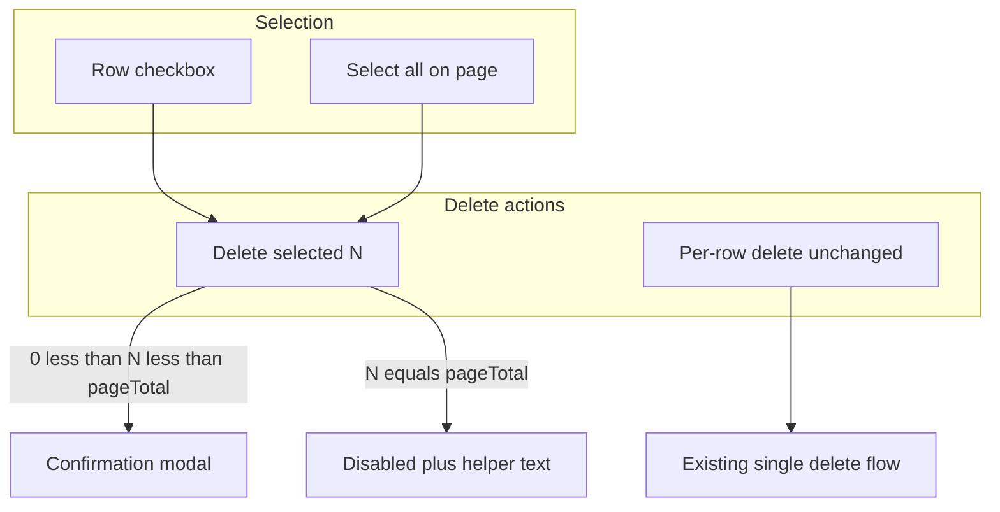

# Drill Builder List — Checkbox Selection & Safe Bulk Delete (Mobile Spec)

> **Version:** 1.0 · **Date:** June 2026  
> **Purpose:** Mobile handoff for tutors and admins to mirror the web Drill Builder drill list: per-drill checkboxes, bulk **Delete selected**, and a safety guard that blocks deleting every visible drill at once.  
> **Prerequisites:** Read [`MOBILE_README.md`](MOBILE_README.md) for auth, error envelope, and React Query conventions.  
> **Web reference:**
> - `src/hooks/useDrillSelection.ts`
> - `src/hooks/useDrills.ts` (`useDeleteDrill`, `useDeleteDrills`)
> - `src/app/(admin)/admin/drill/page.tsx` (admin table)
> - `src/app/(tutor)/tutor/drills/drills-list-client.tsx` (tutor cards)
> - `src/components/drills/TutorDrillCard.tsx`

---

## Table of Contents

1. [Overview](#1-overview)
2. [Screens & Roles](#2-screens--roles)
3. [Selection Rules](#3-selection-rules)
4. [UI Specification](#4-ui-specification)
5. [API Integration](#5-api-integration)
6. [Reference Implementation](#6-reference-implementation)
7. [Learning Journey Catalog Update — Grammar Topic](#7-learning-journey-catalog-update--grammar-topic)
8. [Learning Journey Catalog Update — Interview Preparation Topic](#8-learning-journey-catalog-update--interview-preparation-topic)
9. [Test Plan](#9-test-plan)

---

## 1. Overview

Tutors and admins manage created drills from a list screen. The web app now supports:

- A **checkbox** on each drill row/card
- A **Select all on page** control
- A **Delete selected (N)** bulk action with confirmation
- A **safety guard**: bulk delete is **disabled when every drill on the current visible list is selected**

Per-row delete (single drill) is unchanged and always available.

There is **no bulk-delete API**. The client deletes drills one at a time via `DELETE /api/v1/drills/:drillId`.



---

## 2. Screens & Roles

| Role | Web route | Mobile screen (suggested) | List API |
|------|-----------|---------------------------|----------|
| **Admin** | `/admin/drill` | `app/(admin)/drills/index.tsx` | `GET /api/v1/drills` |
| **Tutor** | `/tutor/drills` | `app/(tutor)/drills/index.tsx` | `GET /api/v1/tutor/drills` |

Both screens share the same selection logic. Layout differs:

| Surface | Layout | Checkbox placement |
|---------|--------|-------------------|
| Admin | Table | First column; header has select-all |
| Tutor | Vertical cards (`TutorDrillCard`) | Left of drill type icon in card header |

Show the bulk-action toolbar only when `someSelected === true` (at least one checkbox checked).

---

## 3. Selection Rules

### 3.1 State model

Maintain a `Set<string>` of selected drill IDs. Derive:

| Field | Formula |
|-------|---------|
| `selectedCount` | `selectedIds.size` |
| `visibleDrillCount` | length of currently visible drill list |
| `allSelected` | `visibleDrillCount > 0` and every visible ID is in the set |
| `someSelected` | `selectedCount > 0` |
| **`canBulkDelete`** | **`selectedCount > 0 && selectedCount < visibleDrillCount`** |

### 3.2 Safety guard (required)

When the user selects **all** drills on the current page:

- **Disable** the **Delete selected** button
- Show helper copy: **"Deselect at least one drill to delete the rest."**
- Set `accessibilityHint` / `title` on the disabled button with the same message

Rationale: prevents accidental wipe of the entire visible list. Users can still delete individual drills via per-row delete.

**Edge case — only one drill on page:** selecting it sets `selectedCount === visibleDrillCount === 1`, so bulk delete stays disabled. Per-row delete still works.

### 3.3 Select-all behavior

- Applies only to drills **currently visible** on the page (after search/filter).
- Admin: paginated page (web uses 50 per page).
- Tutor: full filtered list (web has no pagination on tutor list).
- If all visible drills are selected → next select-all click **clears** selection.
- Otherwise → select all visible drill IDs.

### 3.4 Reset selection

Clear the set when any of these change (web passes a `resetKey` string):

| Screen | Reset when |
|--------|------------|
| Admin | `offset`, `q`, `type`, `status`, `student` filter changes |
| Tutor | `q`, `status` filter changes |

Also clear after a successful bulk delete.

---

## 4. UI Specification

### 4.1 Selection toolbar (visible when `someSelected`)

```
┌──────────────────────────────────────────────────────────────┐
│  [☑ select all]   3 drills selected                          │
│  [🗑 Delete selected (3)]   Deselect at least one drill…     │  ← helper only when !canBulkDelete
└──────────────────────────────────────────────────────────────┘
```

| Element | Behavior |
|---------|----------|
| Select-all checkbox | Toggles all visible drills (tutor toolbar); admin uses table header checkbox |
| Count label | `{N} drill(s) selected` |
| Delete selected | Opens confirmation modal; disabled when `!canBulkDelete` or delete in flight |
| Helper text | Shown when all visible drills selected |

### 4.2 Admin table row (reference)

```
| [☐] | 📚 Drill title    | Type | Difficulty | Assigned | Date | Status | Actions |
```

- Row checkbox: `aria-label="Select {drill.title}"`
- Header checkbox: `aria-label="Select all drills on this page"`

### 4.3 Tutor card row (reference)

```
┌─────────────────────────────────────────────────────────┐
│ [☐] 📚  Drill title                          [✎][🗑][›] │
│         beginner · vocabulary                           │
│         👥 2 students   🕐 Due Jan 15   Assigned        │
└─────────────────────────────────────────────────────────┘
```

Optional props on card component:

```typescript
selectable?: boolean;
checked?: boolean;
onCheckedChange?: (checked: boolean) => void;
```

### 4.4 Bulk delete confirmation modal

| Field | Content |
|-------|---------|
| Title | `Delete Selected Drills` |
| Body | `Are you sure you want to delete {N} drill(s)? This action cannot be undone.` |
| List | Up to 5 drill titles, then `and {M} more...` if needed |
| Cancel | Closes modal, keeps selection |
| Delete | Runs bulk delete; closes modal and clears selection on success |

### 4.5 Single delete (unchanged)

Keep existing per-row/card delete with its own confirmation (admin: modal; tutor: `confirm()` dialog on web). Single delete does **not** require the row checkbox to be checked.

### 4.6 Accessibility

| Control | Requirement |
|---------|-------------|
| Row checkbox | `accessibilityLabel={`Select ${title}`}` |
| Select all | `accessibilityLabel="Select all drills on this page"` |
| Disabled bulk delete | `accessibilityHint="Deselect at least one drill to delete the rest."` |

---

## 5. API Integration

### 5.1 List drills

**Admin — all drills (paginated)**

```
GET /api/v1/drills?limit=50&offset=0&q=&type=&assignmentStatus=&assignedToIds=
Authorization: Bearer <token>
Role required: admin
```

Response (Pattern A or top-level):

```typescript
{
  data?: {
    drills: DrillListItem[];
    total?: number;
    pagination?: { limit: number; offset: number; total: number };
  };
  drills?: DrillListItem[];
  total?: number;
}
```

**Tutor — own drills**

```
GET /api/v1/tutor/drills?limit=20&offset=0&assignmentStatus=saved|assigned
Authorization: Bearer <token>
Role required: tutor
```

Response:

```typescript
{
  drills: DrillListItem[];
  total: number;
  limit: number;
  offset: number;
}
```

**`DrillListItem` fields used by list UI** (non-exhaustive):

```typescript
interface DrillListItem {
  _id: string;
  title: string;
  type: string;
  difficulty: string;
  date: string;
  duration_days?: number;
  context?: string;
  is_active?: boolean;
  assigned_to?: string[];
  totalAssignments?: number;
}
```

### 5.2 Delete one drill

```
DELETE /api/v1/drills/{drillId}
Authorization: Bearer <token>
Roles: admin | tutor
```

Success:

```typescript
{ code: "Success", message: "Drill deleted successfully", data?: { message: string } }
```

The server cascades deletion of assignments, attempts, bookmarks, and related learner data for that drill. Tutors may only delete drills they created; admins can delete any drill.

### 5.3 Bulk delete (client-side only)

No dedicated endpoint. Loop selected IDs sequentially:

```typescript
async function deleteDrills(drillIds: string[]) {
  const failures: string[] = [];
  for (const id of drillIds) {
    try {
      await apiClient.delete(`/drills/${id}`);
    } catch {
      failures.push(id);
    }
  }
  return {
    deletedCount: drillIds.length - failures.length,
    failures,
  };
}
```

**Toasts / feedback:**

| Outcome | Message |
|---------|---------|
| All succeed | `Deleted {N} drill(s)` |
| Partial failure | Success toast for deleted count + error toast `Failed to delete {M} drill(s)` |
| All fail | Error toast only; keep modal open or leave selection intact |

**Cache invalidation:** after any successful delete, refetch drill list queries (admin + tutor keys if your app shares a query client).

Web invalidates:

- `queryKeys.drills.tutor.all()`
- `queryKeys.drills.all` (admin lists)

Suggested mobile keys:

```typescript
['tutor-drills', filters]
['admin-drills', filters]
```

---

## 6. Reference Implementation

Port this hook to React Native (same logic, no DOM):

```typescript
// hooks/useDrillSelection.ts
import { useCallback, useEffect, useMemo, useState } from 'react';

export function useDrillSelection(
  visibleDrillIds: string[],
  resetKey?: string,
) {
  const [selectedIds, setSelectedIds] = useState<Set<string>>(new Set());
  const selectionResetKey = `${resetKey ?? ''}|${visibleDrillIds.join(',')}`;

  useEffect(() => {
    setSelectedIds(new Set());
  }, [selectionResetKey]);

  const toggle = useCallback((id: string) => {
    setSelectedIds((prev) => {
      const next = new Set(prev);
      if (next.has(id)) next.delete(id);
      else next.add(id);
      return next;
    });
  }, []);

  const toggleAll = useCallback(() => {
    setSelectedIds((prev) => {
      const allSelected =
        visibleDrillIds.length > 0 &&
        visibleDrillIds.every((id) => prev.has(id));
      return allSelected ? new Set() : new Set(visibleDrillIds);
    });
  }, [visibleDrillIds]);

  const clear = useCallback(() => setSelectedIds(new Set()), []);

  const selectedCount = selectedIds.size;
  const visibleDrillCount = visibleDrillIds.length;
  const allSelected =
    visibleDrillCount > 0 &&
    visibleDrillIds.every((id) => selectedIds.has(id));
  const someSelected = selectedCount > 0;
  const canBulkDelete =
    selectedCount > 0 && selectedCount < visibleDrillCount;

  const selectedIdList = useMemo(
    () => visibleDrillIds.filter((id) => selectedIds.has(id)),
    [visibleDrillIds, selectedIds],
  );

  return {
    selectedIdList,
    selectedCount,
    visibleDrillCount,
    allSelected,
    someSelected,
    canBulkDelete,
    isSelected: (id: string) => selectedIds.has(id),
    toggle,
    toggleAll,
    clear,
  };
}
```

**Tutor screen wiring example:**

```typescript
const visibleDrillIds = filteredDrills.map((d) => d._id);
const selection = useDrillSelection(
  visibleDrillIds,
  `${filters.q}|${filters.status}`,
);

// In list render:
<TutorDrillCard
  selectable
  checked={selection.isSelected(drill._id)}
  onCheckedChange={() => selection.toggle(drill._id)}
  onDelete={handleSingleDelete}
/>
```

**Bulk delete mutation (React Query):**

```typescript
export function useDeleteDrills() {
  const queryClient = useQueryClient();
  return useMutation({
    mutationFn: deleteDrills, // sequential loop above
    onSuccess: ({ deletedCount, failures }) => {
      queryClient.invalidateQueries({ queryKey: ['tutor-drills'] });
      queryClient.invalidateQueries({ queryKey: ['admin-drills'] });
      if (deletedCount > 0) {
        toast.success(`Deleted ${deletedCount} drill(s)`);
      }
      if (failures.length > 0) {
        toast.error(`Failed to delete ${failures.length} drill(s)`);
      }
    },
  });
}
```

---

## 7. Learning Journey Catalog Update — Grammar Topic

When creating or editing drills in the Drill Builder, tutors/admins assign a **Mission** and **Topic** from a hard-coded catalog. Web source of truth:

`src/domain/learning-journey/learning-journey.catalog.ts`

### Mission 4: Bonus Scenarios — updated topics

| Order | Topic ID | Title | Free Talk scenario type |
|------:|----------|-------|-------------------------|
| 1 | `phone_colleagues` | Phone Communication with Colleagues | `phone_colleague` |
| 2 | `phone_other_departments` | Phone Communication with Other Departments | `phone_department` |
| 3 | `phone_patient_families` | Phone Communication with the Patient's Families | `phone_family` |
| 4 | **`grammar`** | **Grammar** | *(none — grammar drills use standard drill builder, not Free Talk)* |
| 5 | **`interview_preparation`** | **Interview Preparation** | *(none — standard drill builder, not Free Talk)* |

### Mobile actions required

1. **Drill Builder (tutor/admin):** Add `Grammar` to the Mission 4 topic picker. Topic value stored as `learning_journey_topic: "grammar"`.
2. **Learner My Plan / Mission Detail:** Render the Grammar topic section even when empty (same as other topics). See [`eklan-mobile-learning-journey-spec.md`](eklan-mobile-learning-journey-spec.md) §4.4.
3. **Validation:** Server accepts `"grammar"` as a valid topic ID when paired with `learning_journey_part: 4`.

> **Keep in sync:** Update mobile catalog constants in the same release as web when `learning-journey.catalog.ts` changes. There is no API for catalog versioning.

Full learner-side catalog spec: [`eklan-mobile-learning-journey-spec.md`](eklan-mobile-learning-journey-spec.md).

For **Interview Preparation**, see [`MOBILE_INTERVIEW_PREPARATION_TOPIC.md`](MOBILE_INTERVIEW_PREPARATION_TOPIC.md).

---

## 8. Learning Journey Catalog Update — Interview Preparation Topic

Mission 4 now includes a fifth topic for interview-focused drills. Full mobile handoff:

**[`MOBILE_INTERVIEW_PREPARATION_TOPIC.md`](MOBILE_INTERVIEW_PREPARATION_TOPIC.md)**

Quick reference:

| Order | Topic ID | Title |
|------:|----------|-------|
| 5 | `interview_preparation` | Interview Preparation |

---

## 9. Test Plan

| # | Scenario | Expected |
|---|----------|----------|
| 1 | Select 2 of 5 drills → Delete selected | Modal confirms; 2 deleted; list refreshes; selection cleared |
| 2 | Select all visible drills | Delete selected disabled; helper text visible |
| 3 | Select all, then deselect one | Delete selected enabled for N−1 drills |
| 4 | Single drill on page, checked | Bulk delete disabled; per-row delete works |
| 5 | Change search/filter/page | Selection cleared |
| 6 | Bulk delete: one ID fails (403/404) | Partial success toast + failure toast; successful rows removed |
| 7 | Admin pagination: select on page 1, go to page 2 | Selection cleared |
| 8 | Create drill with Mission 4 + topic `grammar` | Saves; appears under Grammar on learner Mission 4 detail |
| 9 | Create drill with Mission 4 + topic `interview_preparation` | Saves; appears under Interview Preparation on learner Mission 4 detail |

---

## Changelog

| Date | Change |
|------|--------|
| July 2026 | Interview Preparation topic under Bonus Scenarios — see [`MOBILE_INTERVIEW_PREPARATION_TOPIC.md`](MOBILE_INTERVIEW_PREPARATION_TOPIC.md) |
| June 2026 | Initial spec: checkbox selection, safe bulk delete, Grammar topic under Bonus Scenarios |
