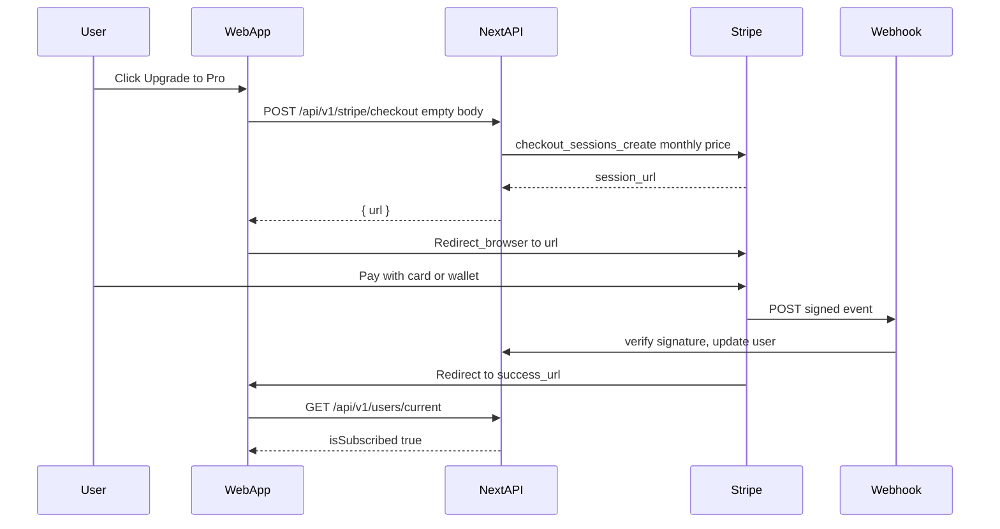

# Stripe Web UI — Student Checkout & Subscription UX

> **Related docs:**
> - [`STRIPE_PAYMENTS_AND_KEYS.md`](./STRIPE_PAYMENTS_AND_KEYS.md) — API keys, webhook contracts, environment variables, backend responsibilities.
> - [`MOBILE_STRIPE_CHECKOUT_ROLLBACK.md`](../MOBILE_STRIPE_CHECKOUT_ROLLBACK.md) — current mobile / API checkout contract after rollback.
> - [`STRIPE_PRICING_UPGRADE.md`](../STRIPE_PRICING_UPGRADE.md) — **historical** multi-plan / trial plan (rolled back).

This document specifies how the **student-facing web UI** integrates with Stripe: single monthly Pro (~US$1.99), no trial, and post-payment access unlock.

---

## 1. Purpose

The student side of the web app is the entry point for purchasing AI feature access. This doc covers:

- What the **subscriptions page** and **profile plan card** should display.
- Single **monthly** checkout (empty body → `STRIPE_PREMIUM_MONTHLY_PRICE_ID`).
- How the **UI updates** after a successful payment.

Backend webhook handling, environment variables, and Stripe key management are in [`STRIPE_PAYMENTS_AND_KEYS.md`](./STRIPE_PAYMENTS_AND_KEYS.md). Mobile: see [`MOBILE_STRIPE_CHECKOUT_ROLLBACK.md`](../MOBILE_STRIPE_CHECKOUT_ROLLBACK.md).

---

## 2. Product Positioning — Pro Only

There is **one purchasable tier: Pro**, sold as a single monthly Stripe Price (~US$1.99).

### Naming alignment

| Layer | Label | Notes |
|---|---|---|
| Stripe Dashboard (Product) | **Pro** | Name it "Eklan Pro" or "Pro" |
| Stripe Dashboard (Price) | Monthly ~US$1.99 | Env: `STRIPE_PREMIUM_MONTHLY_PRICE_ID` |
| MongoDB `subscriptionPlan` | `"premium"` | Backend maps Stripe Pro → `premium` |
| UI display (`planTitleFromUser`) | `"Pro"` | Marketing label for `subscriptionPlan === "premium"` |

### Subscriptions page layout

**Two-column** Free vs Pro comparison. Unsubscribed users see a single **Upgrade to Pro** CTA (no period picker, no trial banner).

| Free | Pro |
|---|---|
| Default access, no payment needed | Paid tier, AI features unlocked |

---

## 3. Price

| Period | Label | Price |
|---|---|---|
| monthly | Monthly | ~US$1.99 |

Existing subscribers on older Prices (US$20 / US$60 / $200) are left as-is.

---

## 4. Pro Card Copy

**Heading:** Pro

**Tagline:** US$1.99 / month — unlock the full AI experience

**Feature bullets:**
- Eklan Free Talk — unlimited AI conversation practice sessions
- Full access to all current and future AI-powered features
- AI-driven feedback and scoring on every session
- Personalised difficulty that adapts as you improve

**CTA button (for non-subscribers):** `Upgrade to Pro`

**CTA button (for subscribers):** `Manage subscription`

No trial copy.

---

## 5. Upgrade CTA — State Rules

Driven by `useUserCurrent` → `GET /api/v1/users/current`:

| User state | UI | On click |
|---|---|---|
| `isSubscribed === false` | Upgrade to Pro | `POST /api/v1/stripe/checkout` with `{}` → redirect |
| `isSubscribed === true` | Manage subscription | `POST /api/v1/stripe/portal` → redirect |

Do **not** use `eligibleForTrial` or `challengePricingActive` (removed).

Loading state: spinner inside the button while the API call is in flight; disable to prevent double-clicks.

---

## 6. Click Flow — Stripe Checkout



### Step-by-step

1. User clicks Upgrade to Pro.
2. Client calls:

```ts
fetch("/api/v1/stripe/checkout", {
  method: "POST",
  headers: { "Content-Type": "application/json" },
  body: JSON.stringify({}),
})
```

3. Backend uses `STRIPE_PREMIUM_MONTHLY_PRICE_ID`, returns `{ url }`. No trial.
4. Client sets `window.location.href = url`.
5. Access is granted via webhook, not by the browser redirect.
6. Stripe redirects to `success_url` (e.g. `/account/settings/subscriptions?checkout=success`).

> **Security note:** the browser redirect is UX only. Access comes exclusively from the verified webhook.

---

## 7. Return to App — Post-Checkout UX

### Success URL

```
https://app.eklan.ai/account/settings/subscriptions?checkout=success
```

### Client behaviour

1. Detect `?checkout=success`.
2. `router.replace` to strip the param.
3. Invalidate `user-current` query; poll `GET /api/v1/users/current` up to **5× every 2s**.
4. When `isSubscribed === true`, toast: **"Welcome to Pro! AI features are now unlocked."**
5. If still false after 5 attempts: soft message that access will activate shortly.

### Cancel URL

`/account/settings/subscriptions` (no query param).

---

## 8. Payment modal stub

**File:** `src/app/(student)/account/payment/modal/page.tsx`

- CTA label: **View plans** → navigates to `/account/settings/subscriptions`.

---

## 9. Error Handling

| Scenario | Behaviour |
|---|---|
| `POST /api/v1/stripe/checkout` returns 400/500 | Toast: "Could not start checkout…" |
| Network error before redirect | Same toast |
| User abandons Checkout | Redirect to `cancel_url`; no backend change |
| `POST /api/v1/stripe/portal` fails | Toast: "Could not open billing portal…" |

---

## 10. Accessibility and Layout

- Mobile-first: Pro card full-width below `md`.
- Loading: `Loader2` + `disabled` on CTA.
- Keep "Questions about subscriptions?" → Contact support.

---

## 11. Implementation checklist (post-rollback)

**[`src/app/api/v1/users/current/route.ts`](../src/app/api/v1/users/current/route.ts)**
- [x] No `eligibleForTrial` / `challengePricingActive` on `safeUser`.

**[`src/app/(student)/account/settings/subscriptions/page.tsx`](../src/app/(student)/account/settings/subscriptions/page.tsx)**
- [x] Free vs Pro layout + current-plan summary.
- [x] Single monthly Pro (~US$1.99); Upgrade to Pro CTA.
- [x] Checkout POST `{}`.
- [x] Portal for subscribed users.
- [x] `?checkout=success` polling (5× / 2s).
