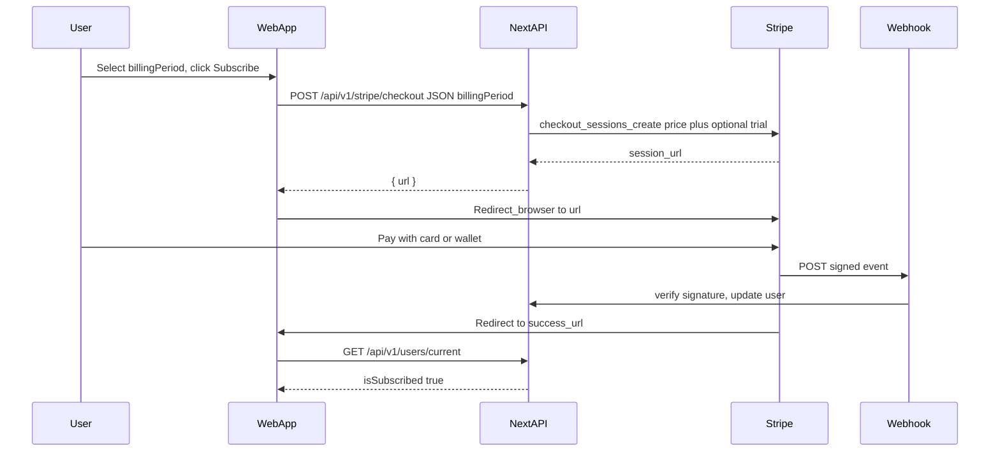

# Stripe Web UI — Student Checkout & Subscription UX

> **Related docs:**
> - [`STRIPE_PAYMENTS_AND_KEYS.md`](./STRIPE_PAYMENTS_AND_KEYS.md) — API keys, webhook contracts, environment variables, backend responsibilities.
> - [`STRIPE_PRICING_UPGRADE.md`](../STRIPE_PRICING_UPGRADE.md) — multi-plan pricing, trial gating, phased rollout (Phase 5 = this UI).

This document specifies how the **student-facing web UI** integrates with Stripe: plan picker, gated trial copy, checkout with `billingPeriod`, and post-payment access unlock.

---

## 1. Purpose

The student side of the web app is the entry point for purchasing AI feature access. This doc covers:

- What the **subscriptions page** and **profile plan card** should display.
- The **three billing periods** and how checkout POSTs `billingPeriod`.
- When to show **"2-week free trial"** (`user.eligibleForTrial`).
- How the **UI updates** after a successful payment.

Backend webhook handling, environment variables, and Stripe key management are in [`STRIPE_PAYMENTS_AND_KEYS.md`](./STRIPE_PAYMENTS_AND_KEYS.md). Mobile UI is out of scope here (see Phase 6 / `MOBILE_EXPO_BILLING.md`).

---

## 2. Product Positioning — Pro Only

There is **one purchasable tier: Pro**, sold as three Stripe Prices (billing periods).

### Naming alignment

| Layer | Label | Notes |
|---|---|---|
| Stripe Dashboard (Product) | **Pro** | Name it "Eklan Pro" or "Pro" |
| Stripe Dashboard (Prices) | Monthly / Quarterly / Annual | Env: `STRIPE_PREMIUM_MONTHLY_PRICE_ID`, `STRIPE_PREMIUM_QUARTERLY_PRICE_ID`, `STRIPE_PREMIUM_ANNUAL_PRICE_ID` |
| MongoDB `subscriptionPlan` | `"premium"` | Backend maps Stripe Pro → `premium` |
| UI display (`planTitleFromUser`) | `"Pro"` | Marketing label for `subscriptionPlan === "premium"` |

### Subscriptions page layout

**Two-column** Free vs Pro comparison, plus a **billing period picker** on the Pro card for unsubscribed users:

| Free | Pro |
|---|---|
| Default access, no payment needed | Paid tier, AI features unlocked |

---

## 3. Billing periods & prices

Unsubscribed users select one period before checkout (default: **monthly**):

| `billingPeriod` | Label | Price |
|---|---|---|
| `monthly` | Monthly | US$20 |
| `quarterly` | 3 months | US$60 |
| `annual` | 1 year | $200 |

---

## 4. Pro Card Copy

**Heading:** Pro

**Tagline:** Unlock the full AI experience

**Feature bullets:**
- Eklan Free Talk — unlimited AI conversation practice sessions
- Full access to all current and future AI-powered features
- AI-driven feedback and scoring on every session
- Personalised difficulty that adapts as you improve

**Trial copy (gated):** Show **"2-week free trial"** **only** when `user.eligibleForTrial === true` (from `GET /api/v1/users/current`). Ineligible users (pre-launch accounts, former/current subscribers) see prices + Subscribe only — no trial language.

**CTA button (for non-subscribers):** `Start free trial` when eligible; otherwise `Subscribe`

**CTA button (for subscribers):** `Manage subscription`

---

## 5. Upgrade CTA — State Rules

Driven by `useUserCurrent` → `GET /api/v1/users/current`:

| User state | UI | On click |
|---|---|---|
| `isSubscribed === false` | Period picker + Subscribe / Start free trial | `POST /api/v1/stripe/checkout` with `{ billingPeriod }` → redirect |
| `isSubscribed === true` | Manage subscription | `POST /api/v1/stripe/portal` → redirect |

Also exposed on the same user object:

| Field | Use |
|---|---|
| `eligibleForTrial` | Gate "2-week free trial" badge/copy (DB-only `isEligibleForTrial`; no Stripe list on every fetch) |
| `subscriptionBillingPeriod` | Current period when subscribed (`monthly` / `quarterly` / `annual`) |

Loading state: spinner inside the button while the API call is in flight; disable to prevent double-clicks.

---

## 6. Click Flow — Stripe Checkout



### Step-by-step

1. User selects a billing period and clicks Subscribe / Start free trial.
2. Client calls:

```ts
fetch("/api/v1/stripe/checkout", {
  method: "POST",
  headers: { "Content-Type": "application/json" },
  body: JSON.stringify({ billingPeriod }), // "monthly" | "quarterly" | "annual"
})
```

3. Backend resolves the Price ID for `billingPeriod`, applies trial only when eligible (DB + Stripe prior-sub check), returns `{ url }`.
4. Client sets `window.location.href = url`.
5. Access is granted via webhook, not by the browser redirect.
6. Stripe redirects to `success_url` (e.g. `/account/settings/subscriptions?checkout=success`).

> **Security note:** the browser redirect is UX only. Access comes exclusively from the verified webhook.

---

## 7. Return to App — Post-Checkout UX

### Success URL

```
https://app.eklan.ai/account/settings/subscriptions?checkout=success
```

### Client behaviour

1. Detect `?checkout=success`.
2. `router.replace` to strip the param.
3. Invalidate `user-current` query; poll `GET /api/v1/users/current` up to **5× every 2s**.
4. When `isSubscribed === true`, toast: **"Welcome to Pro! AI features are now unlocked."**
5. If still false after 5 attempts: soft message that access will activate shortly.

### Cancel URL

`/account/settings/subscriptions` (no query param).

---

## 8. Payment modal stub

**File:** `src/app/(student)/account/payment/modal/page.tsx`

- Does **not** advertise a free trial (eligibility is not loaded here).
- CTA label: **View plans** → navigates to `/account/settings/subscriptions` (canonical picker + gated trial).

---

## 9. Error Handling

| Scenario | Behaviour |
|---|---|
| `POST /api/v1/stripe/checkout` returns 400/500 | Toast: "Could not start checkout…" |
| Network error before redirect | Same toast |
| User abandons Checkout | Redirect to `cancel_url`; no backend change |
| `POST /api/v1/stripe/portal` fails | Toast: "Could not open billing portal…" |

---

## 10. Accessibility and Layout

- Mobile-first: Pro card full-width below `md`.
- Billing options: `role="radiogroup"` with `aria-checked` on each option.
- Loading: `Loader2` + `disabled` on CTA.
- Keep "Questions about subscriptions?" → Contact support.

---

## 11. Implementation checklist (Phase 5)

**[`src/app/api/v1/users/current/route.ts`](../src/app/api/v1/users/current/route.ts)**
- [x] `eligibleForTrial: isEligibleForTrial(user)` on `safeUser` (DB-only).

**[`src/app/(student)/account/settings/subscriptions/page.tsx`](../src/app/(student)/account/settings/subscriptions/page.tsx)**
- [x] Free vs Pro layout + current-plan summary.
- [x] Three billing options (monthly / quarterly / annual); default monthly.
- [x] "2-week free trial" only when `eligibleForTrial === true`.
- [x] Checkout POST `{ billingPeriod }`.
- [x] Portal for subscribed users.
- [x] `?checkout=success` polling (5× / 2s).

**[`src/app/(student)/account/payment/modal/page.tsx`](../src/app/(student)/account/payment/modal/page.tsx)**
- [x] Remove 7-day / fake setTimeout stub; CTA **View plans** → subscriptions.
