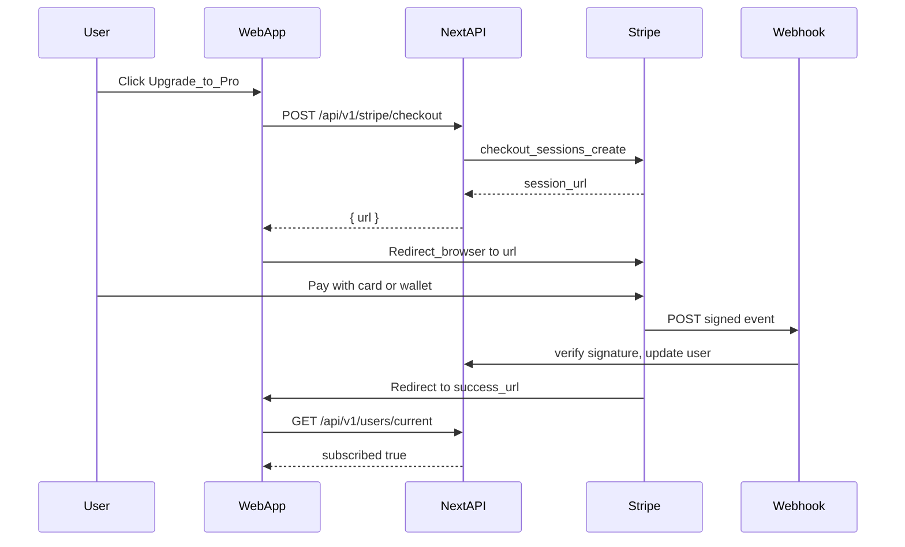

# Stripe Web UI — Student Checkout & Subscription UX

> **Related doc:** [`STRIPE_PAYMENTS_AND_KEYS.md`](../STRIPE_PAYMENTS_AND_KEYS.md) (canonical) — API keys, webhook contracts, environment variables, backend responsibilities. Read that first.

This document specifies how the **student-facing web UI** integrates with Stripe: what the profile and subscriptions pages should look like, what copy the Pro card carries, how the upgrade button wires to Stripe Checkout, and exactly how access is granted after payment. It is documentation for implementation; no code is changed here.

---

## 1. Purpose

The student side of the web app is the entry point for purchasing AI feature access. This doc covers:

- What the **subscriptions page** and **profile plan card** should display.
- The exact **click-to-checkout flow** and the security boundary between browser and backend.
- How the **UI updates** after a successful payment.
- An **implementation checklist** of the specific files to change.

Backend webhook handling, environment variables, and Stripe key management are all in [`STRIPE_PAYMENTS_AND_KEYS.md`](../STRIPE_PAYMENTS_AND_KEYS.md). Mobile UI is out of scope here (but uses the same checkout URL pattern—see §5 note).

---

## 2. Product Positioning — Pro Only (v1)

For the initial Stripe launch, there is **one purchasable tier: Pro**.

### Naming alignment

| Layer | Label | Notes |
|---|---|---|
| Stripe Dashboard (Product) | **Pro** | Name it "Eklan Pro" or "Pro" — keep it consistent with what users see |
| Stripe Dashboard (Price) | e.g. "Pro — Monthly" | One Price ID stored as `STRIPE_PREMIUM_MONTHLY_PRICE_ID` |
| MongoDB `subscriptionPlan` field | `"premium"` | Existing enum value; no DB schema rename required for v1. Backend maps Stripe Pro → `premium`. |
| UI display (`planTitleFromUser`) | `"Pro"` | Will come from `subscriptionPlan === "premium"` once `STUDENT_PLAN_LABEL_OVERRIDE` is removed (see §9) |

> **DB note:** the MongoDB enum uses `"free"` / `"premium"`. The word "Pro" is purely a marketing label in the UI. When reading the database or API responses, `subscriptionPlan: "premium"` means the user is on the Pro plan.

### Subscriptions page layout

Replace the current three-column **Free / Premium / Pro** layout with a **two-column** layout:

| Free | Pro |
|---|---|
| Default access, no payment needed | Paid tier, AI features unlocked |

The goal is a clear "what you have" vs "what you unlock" comparison. The **Premium** column (which was never sold) should be removed. The design can keep the existing `Card` component structure.

---

## 3. Pro Card Copy

Replace the current Pro bullets (live tutoring, custom curriculum, speech analysis) with AI-focused copy that maps to the gated features listed in [`STRIPE_PAYMENTS_AND_KEYS.md §2`](../STRIPE_PAYMENTS_AND_KEYS.md).

### Suggested Pro card content

**Heading:** Pro

**Tagline:** Unlock the full AI experience

**Feature bullets:**
- Eklan Free Talk — unlimited AI conversation practice sessions
- Eklan Pressure Test — timed, high-pressure AI speaking drills
- Full access to all current and future AI-powered features
- AI-driven feedback and scoring on every session
- Personalised difficulty that adapts as you improve

**CTA button (for non-subscribers):** `Upgrade to Pro`

**CTA button (for subscribers):** `Manage subscription`

Keep wording user-facing; do not expose internal route names like `/api/v1/pressure-test/chat`.

### Free card content (for comparison column)

**Heading:** Free

**Feature bullets:**
- Basic pronunciation practice
- Progress tracking
- Limited daily activity

---

## 4. Upgrade CTA — State Rules

The button on the Pro card has two states driven by `me.subscribed` from `useUserCurrent` (which reads `/api/v1/users/current`).

| User state | Button label | On click |
|---|---|---|
| `subscribed === false` | **Upgrade to Pro** | `POST /api/v1/stripe/checkout` → redirect to Stripe |
| `subscribed === true` | **Manage subscription** | `POST /api/v1/stripe/portal` → redirect to Billing Portal |

The button is always visible. There is no hidden state — users who are already subscribed should be able to manage (cancel, update card) at any time.

Loading state: show a spinner inside the button while the API call is in flight; disable the button to prevent double-clicks.

---

## 5. Click Flow — Stripe Checkout



### Step-by-step

1. User clicks **Upgrade to Pro** on the subscriptions page.
2. Client calls `POST /api/v1/stripe/checkout` (authenticated, no body required — the backend looks up the user's `stripeCustomerId` and the configured Price ID).
3. Backend creates a Stripe Checkout Session with `mode: "subscription"` and the Pro Price ID. It returns `{ url: "https://checkout.stripe.com/..." }`.
4. Client sets `window.location.href = url` — the entire browser navigates to Stripe's hosted Checkout page.
5. The user enters payment details (card, Apple Pay, Google Pay, etc. — whatever Stripe has enabled for the account in Dashboard → Payment methods).
6. **Access is granted via webhook, not by the browser.** When Stripe confirms payment, it fires a signed `checkout.session.completed` event to `POST /api/v1/webhooks/stripe`. The backend verifies the signature with `STRIPE_WEBHOOK_SECRET`, updates `subscriptionPlan = "premium"` and `subscriptionExpiresAt` on the user, and stores `stripeCustomerId` / `stripeSubscriptionId`.
7. Stripe redirects the browser to `success_url` (e.g. `/account/settings/subscriptions?checkout=success`).

> **Security note:** the browser redirect back to the app is for UX only. It **does not** grant access. Access comes exclusively from the verified webhook. This is why the `success_url` only triggers a cache refresh, not a trust decision.

> **Mobile note:** the mobile app follows the same pattern — call `POST /api/v1/stripe/checkout`, receive `{ url }`, open in `expo-web-browser` / `SFSafariViewController` / `CustomTabsIntent`, then deep-link back to the app on success.

---

## 6. Return to App — Post-Checkout UX

### Success URL

Configure the Checkout Session's `success_url` as:

```
https://app.eklan.ai/account/settings/subscriptions?checkout=success
```

(Replace domain with actual production URL; use `localhost:3000` in test mode.)

### Client behaviour on landing at success URL

1. Detect `?checkout=success` query param.
2. Immediately **invalidate the `useUserCurrent` TanStack Query cache** so the profile plan badge and the Pro card CTA re-render with live data.
3. If `me.subscribed === true` after refetch, show a `sonner` toast: **"Welcome to Pro! AI features are now unlocked."**
4. Remove the `?checkout=success` param from the URL (use `router.replace`) to prevent the toast re-firing on page refresh.

### Webhook delay handling

Webhooks typically arrive within a few hundred milliseconds of payment confirmation, but can take a few seconds in rare cases. If the user lands on `success_url` and `me.subscribed` is still `false`:

- Show a softer message: **"Payment received — activating your Pro access…"**
- Poll `GET /api/v1/users/current` every 2 seconds for up to 10 seconds.
- Stop polling as soon as `subscribed === true` and show the success toast.
- If still `false` after 10 seconds, show: **"Your payment is confirmed. Access will activate shortly — refresh if it doesn't appear in a minute."**

### Cancel URL

Configure `cancel_url` as `/account/settings/subscriptions` (no query param). No state changes; the user lands back on the subscriptions page unchanged.

---

## 7. Error Handling

| Scenario | Behaviour |
|---|---|
| `POST /api/v1/stripe/checkout` returns 400/500 | Show toast: "Could not start checkout. Please try again or contact support." |
| Network error before redirect | Same toast |
| User abandons Stripe Checkout (close tab, click back) | Stripe redirects to `cancel_url`; no change on backend |
| `POST /api/v1/stripe/portal` fails | Show toast: "Could not open billing portal. Please try again." |

Do not expose Stripe error codes or internal messages to the user in production.

---

## 8. Accessibility and Layout

- **Mobile-first:** on screens narrower than `md` breakpoint, render the Pro card as a full-width single column. Use the existing `Card` component.
- **CTA button:** use `Button` with `variant="default"` (green fill) for Upgrade; `variant="outline"` for Manage subscription. Include an `aria-label` if the button label alone is not fully descriptive in context.
- **Loading state:** replace button label with a spinner (`lucide-react` `Loader2` with `animate-spin`) and set `disabled` while the API call is in flight.
- The existing "Questions about subscriptions?" → Contact support link at the bottom of the page should remain as a secondary affordance.
- No new libraries are needed for this UI; Stripe Checkout is fully hosted.

---

## 9. Implementation Checklist (UI PR)

These are the specific changes needed when implementing this design. Each item maps to an existing file.

**[`src/app/(student)/account/settings/subscriptions/page.tsx`](../src/app/(student)/account/settings/subscriptions/page.tsx)**
- [ ] Remove `CURRENT_PLAN_ID` hardcoded to `"pro"`.
- [ ] Import `useUserCurrent` and derive `isSubscribed` from `me?.subscribed` (or `isUserSubscribed(me?.user)`).
- [ ] Replace `PLANS` array with a two-entry array: **Free** (static, no button) and **Pro** (dynamic CTA).
- [ ] Update Pro card `features` array to the AI-focused bullets listed in §3.
- [ ] Add **Upgrade to Pro** button when `!isSubscribed`; **Manage subscription** when `isSubscribed`.
- [ ] Wire **Upgrade** button to `POST /api/v1/stripe/checkout` → redirect.
- [ ] Wire **Manage** button to `POST /api/v1/stripe/portal` → redirect.
- [ ] Handle `?checkout=success` query param: invalidate query, show toast, poll if needed (§6).

**[`src/lib/learner-learning-goals.ts`](../src/lib/learner-learning-goals.ts)**
- [ ] Remove (or set to `null`) `STUDENT_PLAN_LABEL_OVERRIDE` so `planTitleFromUser` reads `subscriptionPlan` from the user object. After this change, a free user sees "Free" and a subscriber sees "Pro" (via the `premium` → "Pro" label in `planTitleFromUser`).
- [ ] Update `planTitleFromUser` to return `"Pro"` when `plan === "premium"` (to match the marketing label).

**[`src/app/(student)/account/profile/page.tsx`](../src/app/(student)/account/profile/page.tsx)**
- [ ] No structural change needed — the plan badge already reads `planTitleFromUser(user)`. Once the override is removed (above), the badge will automatically reflect real subscription state.
- [ ] Optionally update `CURRENT_PLAN_CARD_MESSAGE` copy to be upgrade-aware (show different message for free vs Pro users).

**New API routes (backend PR, separate from UI PR)**
- [ ] `POST /api/v1/stripe/checkout` — per implementation step 3 in [`STRIPE_PAYMENTS_AND_KEYS.md §9`](../STRIPE_PAYMENTS_AND_KEYS.md).
- [ ] `POST /api/v1/stripe/portal` — per implementation step 4 in [`STRIPE_PAYMENTS_AND_KEYS.md §9`](../STRIPE_PAYMENTS_AND_KEYS.md).

> The UI PR can be merged before the backend routes exist—guard the button with a feature flag or keep it disabled until the API is live.
