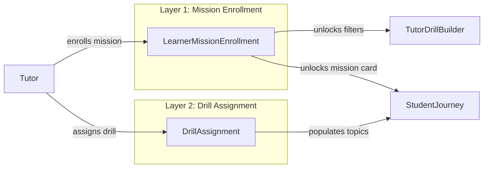
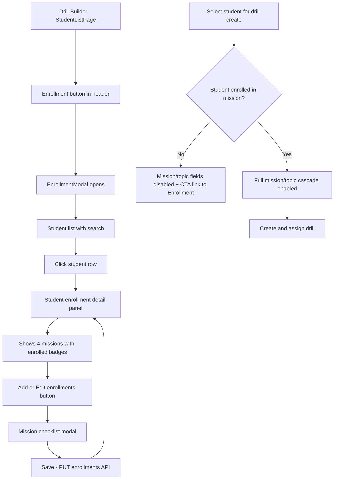
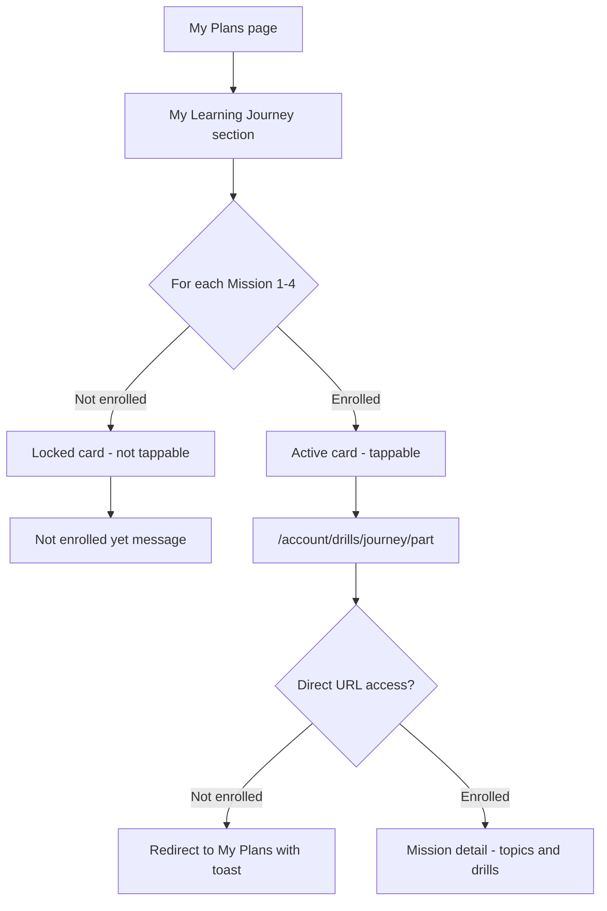
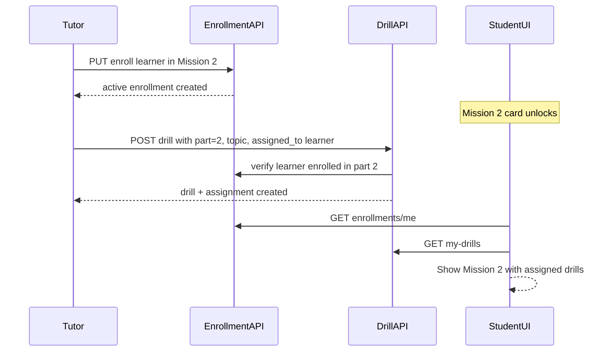

# Learning Journey Mission Enrollment System

> **Status:** Planned — not yet implemented  
> **Last updated:** July 9, 2026

## Overview

Introduce mission-level enrollment (Missions 1–4) as a gate between tutor roster assignment and drill assignment. Tutors and admins enroll learners per mission via a new **Enrollment** modal in the Drill Builder. Enrollment unlocks mission/topic filters when creating drills and controls which missions are accessible on the student **My Learning Journey**.

**Product decisions (confirmed):**

- Unenrolled missions appear **locked** on the student journey with a *"Not enrolled yet"* message.
- Existing students are **auto-enrolled only for missions where they already have assigned drills** (migration).

---

## Problem

Today, all 4 Learning Journey missions are visible to every subscribed student (`src/app/(student)/account/drills/page.tsx`), and tutors can pick any mission/topic when assigning drills (`src/components/admin/LearningJourneyPartTopicFields.tsx`). There is no enrollment layer — only `DrillAssignment` (drill content) and `ClassEnrollment` (live sessions) exist.

**Goal:** Tutors/admins must enroll a student in a mission before:

1. They can use mission/topic filters for that student when creating/assigning drills.
2. The student can access that mission in My Learning Journey.

Drill assignment remains the second step that populates topic content inside an enrolled mission.

---

## Core Concepts (Two-Layer Model)



| Layer | Record | Unlocks for tutor | Unlocks for student |
|-------|--------|-------------------|---------------------|
| **Enrollment** | `LearnerMissionEnrollment` (learner + mission part) | Mission/topic pickers in drill create/AI forms | Mission card becomes accessible (not locked) |
| **Assignment** | `DrillAssignment` (learner + drill) | N/A (output of create flow) | Drill rows inside mission topics |

**Enrollment granularity:** Mission level only (`learning_journey_part` 1–4), matching `LEARNING_JOURNEY_PARTS` in `src/domain/learning-journey/learning-journey.catalog.ts`. All topics within an enrolled mission are available to the tutor for filtering.

---

## Data Model

### New collection: `learner_mission_enrollments`

New file: `src/models/learner-mission-enrollment.ts`

```typescript
interface ILearnerMissionEnrollment {
  learnerId: ObjectId;          // ref User
  learningJourneyPart: 1 | 2 | 3 | 4;
  enrolledBy: ObjectId;         // ref User (tutor or admin)
  enrolledAt: Date;
  status: 'active' | 'withdrawn';
  createdAt / updatedAt;
}
// Unique index: { learnerId, learningJourneyPart }
```

### New domain layer

- `src/domain/learning-journey/mission-enrollment.service.ts` — CRUD, bulk enroll/withdraw, access checks
- `src/domain/learning-journey/mission-enrollment.repository.ts`

### Key helper functions

```typescript
getEnrolledPartsForLearner(learnerId): LearningJourneyPartId[]
isLearnerEnrolledInPart(learnerId, part): boolean
getEnrolledPartsForLearners(learnerIds[]): Map<learnerId, part[]>
```

---

## API Routes

| Method | Route | Who | Purpose |
|--------|-------|-----|---------|
| `GET` | `/api/v1/learning-journey/enrollments` | Tutor, Admin | List enrollments (filter by `learnerId`, optional `tutorId` scope) |
| `GET` | `/api/v1/learning-journey/enrollments/learner/[learnerId]` | Tutor, Admin, Learner (own) | All enrolled missions for one learner |
| `PUT` | `/api/v1/learning-journey/enrollments/learner/[learnerId]` | Tutor, Admin | Set enrolled missions (array of parts 1–4); diff add/withdraw |
| `GET` | `/api/v1/learning-journey/enrollments/me` | Learner | Own enrolled missions for student UI |

**Authorization:**

- Tutors: only learners in their roster (`TutorAssignment` via `src/domain/tutor-assignments/tutor-assignment.service.ts`)
- Admins: any learner
- Learners: read own enrollments only

**Server-side enforcement** (not just UI):

- `POST /api/v1/drills`, bulk-create, and assign routes: reject if any `assigned_to` learner is not enrolled in the drill's `learning_journey_part`
- `refineLearningJourneyFields` in `src/domain/learning-journey/learning-journey.validation.ts`: add optional `enrolledParts` context for client validation

---

## Tutor/Admin UX Flow



### UI components (new)

| Component | Location | Behavior |
|-----------|----------|----------|
| `EnrollmentButton` | Header of `StudentListPage.tsx` and optionally `StudentDetailPage.tsx` | Opens modal |
| `MissionEnrollmentModal` | `src/components/learning-journey/MissionEnrollmentModal.tsx` | Two-step: student picker → detail |
| `StudentMissionEnrollmentDetail` | Same folder | Lists 4 missions; enrolled = checkmark; unenrolled = empty |
| `MissionEnrollmentChecklist` | Same folder | Checkbox list of Missions 1–4; pre-selects current; Save calls PUT |

### Modal flow detail

1. **Step 1 — Student list:** Reuse roster from `useTutorStudents` / `useAiDrillBuilderLearners` (same sources as drill builder). Search, avatar, name, email. Show small badge: *"2/4 missions enrolled"*.
2. **Step 2 — Student detail:** Header with student info. Section *"Enrolled Missions"* listing active enrollments with mission title from catalog. **"Manage enrollments"** button opens checklist sub-modal (or inline expand).
3. **Checklist:** All 4 missions from `LEARNING_JOURNEY_PARTS`. Checked = enrolled. Save sends full desired set; server diffs.

**Secondary entry point:** `StudentDetailPage.tsx` header — *"Enrollments"* chip/button showing `2/4` for quick access without returning to list.

### Drill create gating

Update `src/components/admin/LearningJourneyPartTopicFields.tsx`:

- New prop: `enrolledParts?: LearningJourneyPartId[]`
- Mission `<select>`: only show enrolled parts (or show all with disabled options + tooltip)
- When single student pre-selected (AI builder week flow): fetch enrollments via hook `useLearnerMissionEnrollments(learnerId)`
- When multiple students selected: mission options = **intersection** of all selected students' enrollments; if empty, block save with message *"No shared enrolled missions — enroll students first"*
- Disabled state copy: *"Enroll this student in a mission first"* with link that opens `MissionEnrollmentModal` pre-focused on that student

Files to wire gating:

- `src/components/drills/DrillFormBody.tsx`
- `src/components/drills/AIGenerationForm.tsx`
- `src/hooks/useAIDrillCreationWorkflow.ts`
- `src/components/drills/drill-form-utils.ts` (client validation before submit)

---

## Student UX Flow



### Student UI changes

**`LearningJourneyPartCard.tsx`:**

- New props: `isEnrolled: boolean`, `isLocked: boolean`
- Enrolled: current behavior (link to journey detail)
- Locked: render as `<div>` (not `<Link>`), greyed styling, lock icon, subtitle *"Not enrolled yet"*

**`src/app/(student)/account/drills/page.tsx`:**

- Fetch `GET /learning-journey/enrollments/me`
- Pass `isEnrolled` per mission card

**`src/app/(student)/account/drills/journey/[part]/page.tsx`:**

- Server-side or client guard: if not enrolled in `part`, redirect to `/account/drills` with message
- Prevents URL bypass

**Assigned drills outside journey UI:** Drills already assigned before enrollment migration remain in `my-drills` API but should only appear inside journey grouping for enrolled missions. Unenrolled mission drills: hide from locked missions; flat home assigned list unchanged for now.

---

## End-to-End System Flow



---

## Migration Strategy

**Rule:** Auto-enroll existing students only for missions where they already have assigned drills with `learning_journey_part` set.

Migration script: `scripts/migrate-mission-enrollments.mjs`

```text
For each DrillAssignment with populated drill.learning_journey_part:
  upsert LearnerMissionEnrollment(learnerId, part, enrolledBy=system, status=active)
```

Run once before deploy. Idempotent via unique index.

**New students:** Start with zero enrollments; tutor must enroll before assigning journey drills.

---

## Hooks and API Client

Add to `src/lib/api.ts`:

```typescript
learningJourneyAPI.getMyEnrollments()
learningJourneyAPI.getLearnerEnrollments(learnerId)
learningJourneyAPI.setLearnerEnrollments(learnerId, parts: number[])
```

Hooks in `src/hooks/useMissionEnrollments.ts`:

- `useMyMissionEnrollments()` — student
- `useLearnerMissionEnrollments(learnerId)` — tutor drill builder
- `useSetLearnerMissionEnrollments()` — mutation with cache invalidation

---

## Implementation Phases

### Phase 1 — Backend foundation

- Model + repository + service
- API routes with auth
- Server enforcement on drill create/assign
- Migration script

### Phase 2 — Tutor enrollment UI

- `MissionEnrollmentModal` + header button on Drill Builder
- Student detail enrollment chip
- Enrollment fetch hooks

### Phase 3 — Drill builder gating

- Filter `LearningJourneyPartTopicFields` by enrolled parts
- Multi-student intersection logic
- Client + server validation alignment

### Phase 4 — Student journey gating

- Locked cards on My Plans
- Journey detail route guard
- `enrollments/me` integration

### Phase 5 — Polish

- Empty states (*"Enrolled but no drills yet"* vs *"Not enrolled yet"*)
- Admin drill builder parity (admin variant of `StudentListPage`)
- Optional: enrollment indicator on `/tutor/students/[id]`

---

## Edge Cases

| Scenario | Behavior |
|----------|----------|
| Tutor withdraws enrollment while drills assigned | Mission locks for student; existing assignments remain in DB but hidden from journey UI until re-enrolled |
| Multi-student drill assign | Only missions enrolled for **all** selected students are pickable |
| Admin assigns drill for tutor's student | Admin can enroll + assign (admin bypass on roster, not on enrollment) |
| Free Talk scenarios mapped to topics | Free Talk rows in journey only show under enrolled missions (match via `freeTalkScenarioType` in catalog) |
| Mission 4 (Interview Preparation) | Same enrollment rules as Missions 1–3 |
| Mission 5 (Bonus Scenarios) | Same enrollment rules as Missions 1–3 |

---

## Files Touched (summary)

**New:** model, repository, service, API routes (3), migration script, 3–4 UI components, 1 hook file

**Modified:** `StudentListPage`, `StudentDetailPage`, `LearningJourneyPartCard`, student drills pages (2), `LearningJourneyPartTopicFields`, `DrillFormBody`, `AIGenerationForm`, `drill-form-utils`, `learning-journey.validation`, drill API routes, `api.ts`

---

## Out of Scope (for this iteration)

- Topic-level enrollment (sub-mission granularity)
- Sequential auto-unlock (Mission 2 after Mission 1 complete)
- Student self-enrollment
- Notifications on enrollment (*"You've been enrolled in Mission 2"*)
- Mobile-native app changes (web API supports both per `docs/eklan-mobile-learning-journey-spec.md`)

---

## Related docs

- `docs/eklan-learners-journey.md` — curriculum overview (Day 1–7)
- `docs/eklan-mobile-learning-journey-spec.md` — student journey UI spec
- `docs/ai-drill-creation-full-implementation.md` — tutor drill builder flows
