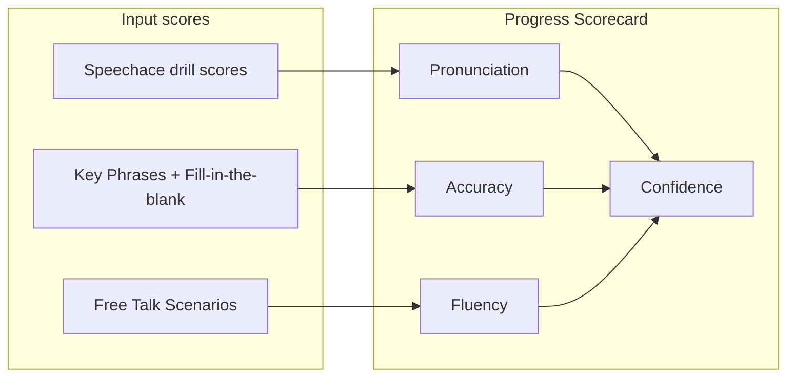

# Progress Scorecard

The **Progress Scorecard** summarizes a learner's communication skills across four categories. Each score is a 0–100 average derived from completed practice activity.

---

## Scorecard overview

| Category | What is measured | How to measure | Notes / comments |
|----------|------------------|----------------|------------------|
| **Pronunciation** | How clearly words and sentences are pronounced, including medical terminology. | The average of Speechace scores across all completed drills. | |
| **Accuracy** | How correctly learners communicate information and use professional phrases. | The average score across assigned Key Phrases and Fill-in-the-blank drills. | |
| **Fluency** | How smoothly and naturally learners speak without unnecessary pauses. | The average score across Eklan Free Talk Scenarios. | |
| **Confidence** | Learner's overall communication effectiveness based on pronunciation, accuracy, and fluency. | The average of the Pronunciation, Accuracy, and Fluency scores above. | |

---

## Category details

### Pronunciation

**Measures:** Clarity of word and sentence pronunciation, including domain-specific (e.g. medical) vocabulary.

**Calculation:**

```
Pronunciation = average(Speechace scores from all completed drills)
```

**Data sources:** Speechace evaluation results from completed pronunciation-related drill attempts.

---

### Accuracy

**Measures:** Correctness of communicated information and appropriate use of professional phrases.

**Calculation:**

```
Accuracy = average(scores from completed Key Phrases drills ∪ Fill-in-the-blank drills)
```

**Data sources:** Scores from assigned **Key Phrases** and **Fill-in-the-blank** drill completions.

---

### Fluency

**Measures:** Smooth, natural speech with minimal unnecessary pauses.

**Calculation:**

```
Fluency = average(scores from completed Eklan Free Talk Scenarios)
```

**Data sources:** Session or scenario scores from **Eklan Free Talk** practice.

---

### Confidence

**Measures:** Overall communication effectiveness, combining the three pillars above.

**Calculation:**

```
Confidence = (Pronunciation + Accuracy + Fluency) / 3
```

Only include categories that have at least one scored activity when computing the average (if a category has no data yet, exclude it from the divisor or treat as N/A — define at implementation time).

---

## Summary



| Metric | Primary activity types |
|--------|------------------------|
| Pronunciation | All drills evaluated by Speechace |
| Accuracy | Key Phrases, Fill-in-the-blank |
| Fluency | Eklan Free Talk Scenarios |
| Confidence | Composite of the three metrics above |

---

## Implementation notes

- Empty pillars (no scored activity yet) show `0` on the dashboard cards and are excluded from the Confidence divisor. For example, a learner with only Pronunciation data will have `Confidence = Pronunciation`.
- Data source: `src/domain/progress/progress-scorecard.service.ts` — called via `GET /api/v1/progress/scorecard`.
- Frontend hook: `src/hooks/useProgressScorecard.ts` — shared by all four Home dashboard cards and the Profile `ConfidenceCard`.
- The score is recomputed in the background every time a drill is completed (`src/app/api/v1/drills/[drillId]/complete/route.ts`).
